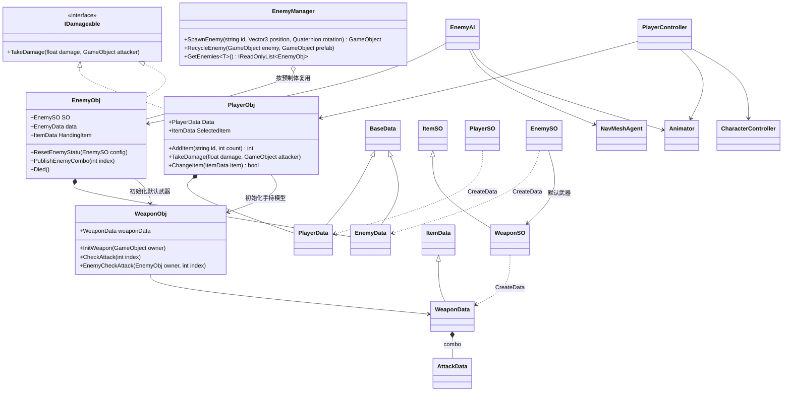
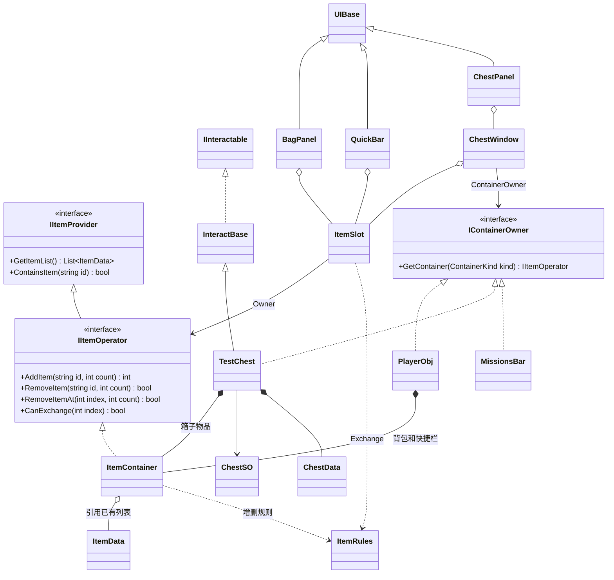
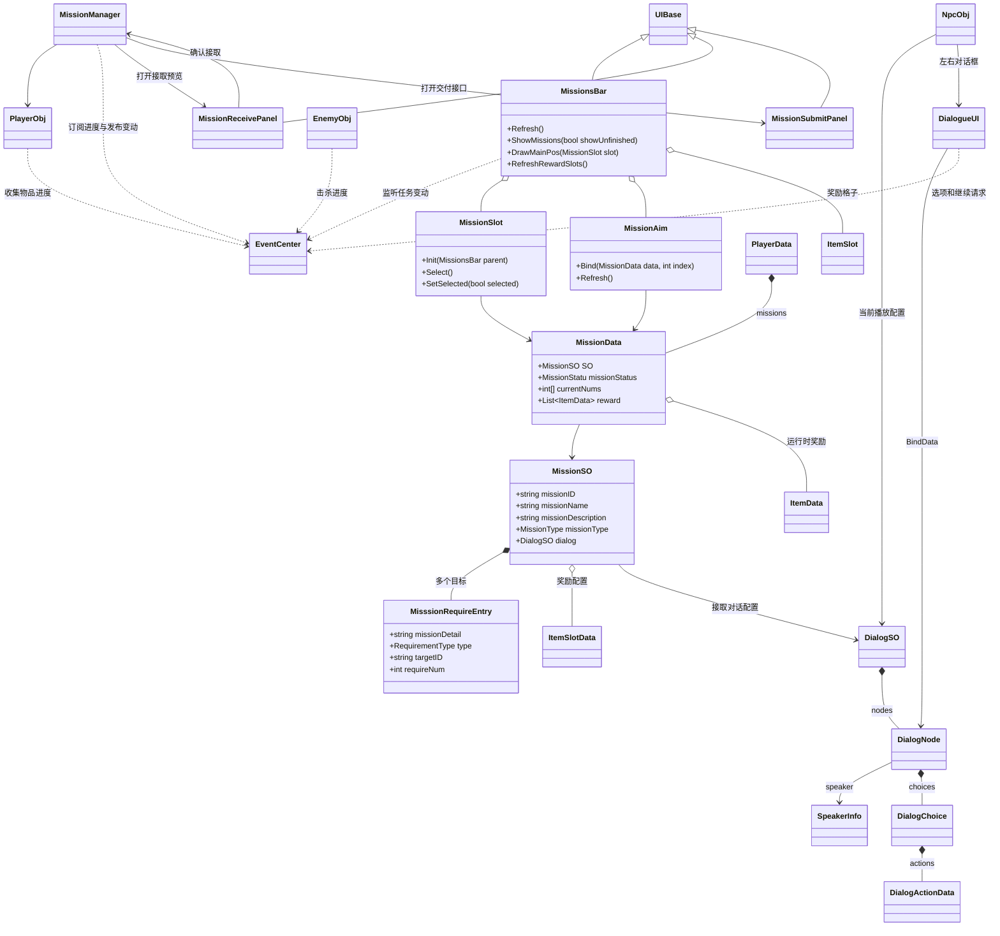
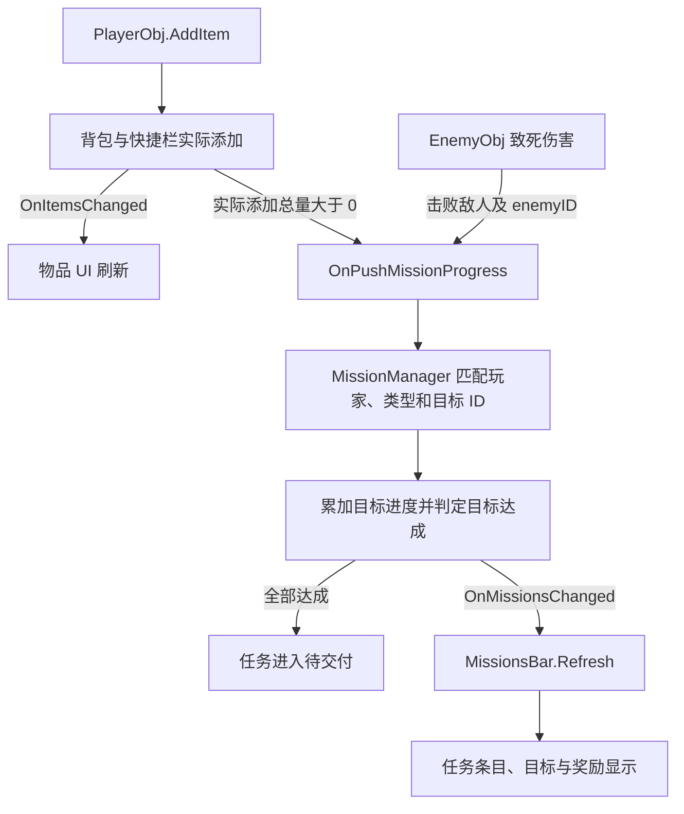

# Shimmering Chronicle

Shimmering Chronicle 是一个持续开发中的 Unity 动作 RPG 练习项目。围绕角色战斗、敌人追逐、物品收集和任务推进，练习 ScriptableObject 配置、运行时数据、事件总线和可复用 UI 的协作。

主场景为 `Assets/Scenes/SampleScene.unity`。仓库名为 `ShimmeringChronicle`，Unity 工程的 `productName` 目前仍为 `Practice`。本文按 2026-10-08 的源码与资产整理；“已实现”表示已有实现与接线，不表示完成了全部 Play Mode 或平台构建验证。类图省略 Unity 基类、调试字段和部分泛型工厂层。

## 1. 当前功能

| 系统 | 已实现内容 |
| --- | --- |
| 玩家 | CharacterController 移动、跑步、动画状态切换、受击、死亡和手持物品切换 |
| 战斗 | 武器运行时数据、AnimatorOverrideController、动画事件驱动的分段攻击、范围与角度判定、同次判定命中去重、角色独立的命中停顿 |
| 敌人 | 触发范围感知、NavMeshAgent 追逐、根运动位移、攻击朝向、连招、攻击间隔和受击硬直 |
| 对象池 | 按敌人预制体复用实例，重置角色与武器数据，死亡动画回调后回收 |
| 物品 | 固定格数背包与快捷栏、堆叠、扣除、交换、拆分、格子选中与模型装备 |
| 交互 | 范围与遮挡检测、F 键交互、箱盖开合、多个箱子窗口、窗口拖拽 |
| 任务 | 接取面板确认后入字典、多目标进度、击杀与新增物品计数、目标达成后进入待交付、任务详情与奖励预览、未完成/已完成列表切换 |
| 对话 | 按节点 ID 推进、任意分支、选项事件、无选项时空格继续、按任务接取/完成情况选起始节点、统一关闭与说话状态通知 |
| UI | 背包、快捷栏、箱子、血条、任务列表、接取面板、左右对话框与短选项按钮；面板打开时限制攻击和鼠标转向 |
| 配置 | Addressables 分别异步加载 `ItemSO`、`EnemySO`、`MissionSO`，通过字符串 ID 查询 |

交任务事件与面板打开入口已写好，但 `MissionSubmitPanel` 仍是接口骨架，未完成面板接线、确认交付、奖励发放与已完成归档。NPC ID、待交付专用对话、地点触发和存档也未完成，见“当前边界”。

## 开发约定

| 约定 | 当前规则 |
| --- | --- |
| 配置与运行时数据 | SO 保存共享配置；HP、数量、进度、状态和攻击间隔写入运行时 Data，不回写 SO。新实例和敌人重生重新创建数据。 |
| ID | `ItemSO.id`、`EnemySO.enemyID`、`MissionSO.missionID` 分别在各自配置表中非空且唯一；`nodeID` 在同一 `DialogSO` 内非空且唯一。不要使用显示名称代替 ID。 |
| 配置加载 | 三类配置分别标记 `ItemSO` / `EnemySO` / `MissionSO`；查询前等待对应 `LoadingTasks`，并检查返回配置是否为空。对话与说话者目前由资产引用，不单独按标签加载。 |
| 容器 | 列表长度表示容量，空位是 `null`；容器包装原列表，初始化后不直接换掉列表引用。玩家新增获取走 `PlayerObj.AddItem`，内部换格不算收集进度。 |
| 任务状态 | `进行中 → 待交付 → 已完成`；达成目标只进入待交付，交付成功后才完成。`missions` 保存尚未交付的任务，`completedMissions` 保存已交付任务 ID。最后一步尚待实现。 |
| 任务进度 | 按玩家、要求类型和 `targetID` 匹配；`currentNums[i]` 对应 `requireMents[i]`，运行期间不要重排目标。只累计进行中的任务。 |
| 对话存储 | `DialogSO.nodes` 保存节点列表，`NpcObj` 建 ID 字典，通过 `nextNodeID` / `targetNodeID` 连成对话图；不要求递归嵌套子节点。空的下一节点 ID 表示结束。 |
| 选项行为 | 先执行 `choice.actions`，再跳转或结束；“打开接任务面板”与“确认接取”是两个动作，打开面板时不写入任务字典。 |
| 事件键 | 使用 `GameEvents` 的 `static readonly EventKey` 实例；事件键按引用匹配，不临时 `new` 同类型的键。发布是同步调用。 |
| 事件过滤与退订 | 按玩家、角色、列表引用或当前对话 UI 过滤。可禁用组件优先成对使用 `OnEnable/OnDisable`；其他订阅也必须有对应退订。`this.Subscribe` 不会自动跟踪对象生命周期。 |
| UI 注册与显示 | `UIManager` 按具体 `UIBase` 类型保留一个实例，动态面板主动注册。`viewRoot` 必须绑定实际视觉根；通过 `Show/Hide` 同步显隐与 `IsOpen`。 |
| UI 层级与布局 | 面板置顶要处理它的父容器；接取框会将父容器和自身移到末尾。屏幕 UI 的 RectTransform Z 保持 0，用兄弟顺序管理覆盖，尺寸适配用锚点和布局组件。 |
| 按钮回调 | 代码监听与 Inspector 的 `On Click()` 都可能存在。任务分类按钮在 `QuestPanel.prefab` 中绑定 `ShowMissions(bool)`，排查回调时一起检查资产接线。 |
| UI 复用 | 任务、目标、奖励和对话选项格子不足时创建，多余时隐藏复用；选项重新绑定前清掉旧按钮监听，避免重复执行。 |
| 输入限制 | 对话中锁移动、攻击、跳跃、换武器和鼠标转向，允许 Tab/V 打开背包和任务、空格继续。普通面板打开时锁攻击与鼠标转向，尚未统一锁移动与 F 交互。 |
| 动画攻击 | 动画事件通知攻击段，武器组件执行实际伤害判定；攻击段 index 从 0 开始。受伤事件回调做反应，不再次扣同一次血。 |
| 局部时间 | `CharacterTime` 控制单角色时间倍率与 Animator 速度，用非缩放时间判定效果到期；高优先级生效，同优先级取更小倍率，禁用时清空效果。 |
| 名称与资源 | `ChestWindow` 是单个箱子窗口，`ChestPanel` 是多窗口界面。资产移动时保留 `.meta` 与 GUID；遵守 `.gitattributes` 的 LFS 规则。 |
| 代码风格 | 优先简单的 bool、if 和有明确职责的函数；避免嵌套三元运算符、空 Update 和多余抽象。现有部分脚本是 GBK，修改前确认编码，避免注释和中文枚举乱码。 |

这些约定描述当前协作方式；代码里仍有未完成项或旧注释时，以实际实现和文末边界为准。

## 2. 环境与启动

| 项目 | 当前配置 |
| --- | --- |
| Unity | `6000.3.10f1` |
| 渲染 | URP `17.3.0` |
| 配置加载 | Addressables `2.9.0`，标签 `ItemSO` / `EnemySO` / `MissionSO` |
| 导航 | AI Navigation `2.0.10` |
| 输入 | Input System `1.18.0`；角色代码目前使用旧 `Input` API，编辑器需允许旧输入 |
| UI | uGUI `2.0.0`、TextMesh Pro、EventSystem |
| 资源版本管理 | Git LFS；模型、贴图等资源按 `.gitattributes` 管理 |

首次获取工程时需安装 Git LFS 并下载资源：

```bash
git lfs install
git clone https://github.com/lphahapl/ShimmeringChronicle.git
cd ShimmeringChronicle
git lfs pull
```

通过 Unity Hub 打开工程，等待资源导入后打开 `SampleScene`。测试敌人使用 NavMesh；场景已有 `Assets/Scenes/SampleScene/NavMesh-GameManager.asset`，调整地形和可通行范围后应重新烘焙。构建游戏前还需按 Addressables 工作流构建资源。

场景主要依赖 `GameManager`、`UIManager`、`EnemyManager` 和 `MissionManager`。玩家需要 `PlayerObj`、`PlayerController`、`Animator`、`CharacterController`，并为 `PlayerObj.config` 指定 `PlayerSO`。当前 `PlayerObj.Awake()` 会用 `t` 创建测试任务并写入 `mission_001`，测试时也需绑定这个 `MissionSO`。

| 操作 | 按键 | 当前行为 |
| --- | --- | --- |
| 移动 | WASD / 方向轴 | 相对摄像机的水平移动 |
| 跑步 | 左 Shift | 使用 `PlayerData.runSpeed` |
| 攻击 | 鼠标左键 | 按当前武器连招配置触发动画，玩家最多三段 |
| 跳跃 / 对话继续 | Space | 非对话时触发跳跃动画；对话中仅无选项的节点可以继续 |
| 交互 | F | 对当前最近且可见的目标执行交互 |
| 背包 | Tab | 开关 `BagPanel` |
| 任务 | V | 开关 `MissionsBar` |
| 手持物品 | 点击玩家物品格 / 鼠标滚轮 | 选择背包或快捷栏格子；滚轮切换快捷栏格子 |
| 测试受伤 | H | 对自身造成 50 点伤害 |
| 测试死亡 | L | 直接改变控制器死亡状态，不等价于将玩家 HP 归零 |

`UIManager.HasOpenPanel` 统计背包、任意箱子窗口、任务列表、接取与提交面板；常驻血条和快捷栏不计入。`PlayerController` 用它限制攻击，`CameraMove` 用它限制鼠标转向，但相机仍跟随角色。对话的 `isTalking` 另外限制移动、跳跃、交互和换武器。普通面板打开时，移动和 F 交互尚未统一屏蔽；鼠标位于物品面板和拖拽期间会限制快捷栏滚轮。

## 3. 目录

```text
Assets/
  Scenes/                      主场景、NavMesh 与任务 UI 预览场景
  Scripts/
    SO/                        玩家、敌人、物品、武器、箱子、任务与对话配置
    Data/                      运行时数据、攻击段数据、GameEvents
    Interfaces/                伤害、交互、容器和手持物品契约
    Logic/                     角色、敌人 AI / 对象池、任务管理、事件中心、物品规则
    UI/                        UI 管理、背包、快捷栏、箱子窗口、任务面板和血条
  Configs/                     玩家、敌人、箱子和任务配置资产
  Prefabs/
    Items/<itemID>/             单个物品的配置与预制体，有动画时放 Animations/
    TestEnemy/                 方块测试敌人、控制器及测试动画
    UI/
      QuestPanel/              任务面板
      QuestOffer/              任务接取对话框
      Dialogue/                左右头像对话框与选项按钮
      Shared/                  任务条目、目标条目、奖励条目和 Canvas
  AddressableAssetsData/       Addressables 标签和分组
  Art/                        角色、武器、地形、房屋、植物与箱子资源
  Editor/                     美术生成、材质修复与场景调试工具
Tools/
  UI/                         UI 设计说明与检查资料
  WeaponConcepts/             武器参考、生成脚本与检查结果
  Environment/                测试地形和装饰生成记录
  SceneBackups/               场景修改前的备份
  ItemSlotTestResults/         历史格子测试记录
```

`Scripts/Logic` 和 `Scripts/UI` 是当前文件位置，例如 `ItemSlot`、`MissionSlot` 位于 `Logic`，`ItemContainer` 位于 `UI`；职责划分以代码为准。

## 4. 类图与职责

### 4.1 角色、敌人和武器

配置创建运行时数据，行为组件使用这些数据。玩家当前手持数据来自选中的物品格；敌人默认武器初始化后，`data.HandingItem` 与 `data.weaponData` 指向同一份武器运行时实例。



图中的 `ItemSO → WeaponSO` 继承关系省略了实际的 `ItemSO<WeaponData>` 中间层；玩家与敌人的 SO 工厂同样经过 `BaseDataSO<TData>`。

### 4.2 物品容器与交互

`ItemContainer` 是普通 C# 对象，包装现有列表；玩家、箱子和任务奖励通过 `IContainerOwner` 暴露容器。`ChestWindow` 表示单个箱子的窗口，`ChestPanel` 表示容纳多个窗口的界面。



### 4.3 任务与 UI

`MissionSO` 定义目标、奖励和发布者，`MissionData` 保存运行时进度。`MissionManager` 处理接取/交付请求和进度通知，UI 监听变动；`NpcObj` 控制对话节点，`DialogueUI` 展示当前节点并发送选择事件。



| 模块 | 职责 |
| --- | --- |
| `GameManager` | 分别加载物品、敌人和任务配置，维护 ID 字典和对应加载任务 |
| `PlayerObj` | 持有玩家数据与容器，提供玩家级加物品入口，处理伤害、交互目标和手持模型 |
| `PlayerController` | 键鼠输入、移动、动画、玩家连招与快捷栏滚轮选择 |
| `EnemyManager` | 敌人注册、按类型查询、按预制体复用实例 |
| `EnemyObj` / `EnemyAI` | 敌人数据与生命周期 / 感知、导航、攻击决策和根运动同步 |
| `WeaponObj` | 按攻击段执行范围和角度检测，并向目标施加伤害 |
| `ItemContainer` / `ItemRules` | 容器增删和通知 / 查找、堆叠、扣除、交换与拆分规则 |
| `MissionManager` | 接取/交任务请求、实际接取、目标匹配与计数、达成目标后设为待交付并通知 UI |
| `NpcObj` / `DialogueUI` | 查询玩家任务与控制节点跳转/关闭 / 展示说话者、正文与选项并发布操作事件 |
| `MissionReceivePanel` / `MissionSubmitPanel` | 接取预览与确认按钮 / 待交付任务的展示、交付与奖励接口骨架 |
| `UIManager` / `UIBase` | 按具体类型管理面板 / 显隐状态与刷新扩展点 |
| `MissionsBar` / `MissionSlot` / `MissionAim` | 任务面板 / 可点击任务条目 / 目标描述、计数和完成标记 |
| `EventCenter` / `GameEvents` | 同步强类型事件总线 / 全局事件键，支持 0～5 个参数 |

## 5. 物品与玩家 API

### 5.1 配置和运行时数据

`PlayerSO.CreateData()`、`EnemySO.CreateData()` 创建角色数据。物品通过 `ItemSO.CreateItemData()` 创建，武器也可使用强类型的 `WeaponSO.CreateData()`。运行时数量、HP、攻击间隔和 Buff 等应写入数据实例，不应回写 SO 资产。

- `ItemData.count` 是当前数量，`stackCount` 是单格上限；非正上限按 1 处理。
- 列表长度就是容器容量，空格保留 `null`。添加物品只合并堆叠和填空格，不追加新格。
- `PlayerSO.bagCapacity`、`quickBarCapacity` 和 `ChestSO.capacity` 用于初始化格数；初始配置超过容量时当前转换方法不会截断。
- 不要在容器初始化后直接替换 `Data.Bag` 或 `Data.quickBar` 的列表实例，容器和 UI 引用的是原列表。
- `ItemData.Clone()` 是浅复制；`WeaponData.Clone()` 另外复制 `combo` 和各个 `AttackData`。Prefab、Sprite 和动画控制器仍共享资产引用。

### 5.2 给玩家添加物品并推进任务

拾取、奖励等“玩家获得物品”的业务入口使用 `PlayerObj.AddItem`：

```csharp
// 在 GameManager.Awake() 执行后调用，例如其他组件的 Start() 中。
await GameManager.Instance.LoadingTasks.ItemComplete;

int requested = 3;
int added = player.AddItem("item_001", requested);
int remaining = requested - added;
```

该方法先放背包，剩余的放快捷栏，返回实际添加数量。各容器沿用 `OnItemsChanged` 刷新物品 UI；总添加数量大于 0 时，额外发布一次：

```csharp
OnPushMissionProgress(player.Data, RequirementType.收集物品, itemID, added)
```

无效 ID、非正数量、未准备好的物品配置或没有可用空间时，不计入未添加的部分。调用方应保留 `remaining`，避免物品未全部入包就销毁整个拾取对象或将奖励标记为已全部领取。

等待加载任务结束后仍需确认 `GetItem(id)` 有结果；加载结束标志不保证 ID 存在或所有配置有效。旧的 `GameManager.Ready` / `IsReady` 已由 `LoadingTasks` / `LoadingStatus` 替代。

### 5.3 直接操作单个容器

```csharp
IItemOperator bag = player.GetContainer(ContainerKind.Bag);
IItemOperator quickBar = player.GetContainer(ContainerKind.QuickBar);
bool owns = player.HasItem("item_001"); // 背包或快捷栏任一存在即可
int total = ItemRules.CountOf(bag.GetItemList(), "item_001");

int added = bag.AddItem("item_001", 5);
bool removed = bag.RemoveItem("item_001", 2);
bool removedAt = bag.RemoveItemAt(0, 1);
```

容器自己的 `AddItem` 只通知物品变化，不通知任务进度。`RemoveItem` 总量不足时完全不扣；`RemoveItemAt` 只操作指定格子。`FindItem(list, id, count)` 检查单格数量，跨堆总量使用 `CountOf`。

`GetContainer()` 默认返回玩家背包；`TestChest` 默认返回自身储物容器；`MissionsBar` 返回当前显示的奖励容器。`ItemContainer` 不是组件，不通过 `GetComponent<IItemOperator>()` 获取。

### 5.4 交换和选择

```csharp
bool allowed = ItemRules.CanExchange(player.Bag, 0, player.QuickBar, 1);
bool moved = ItemRules.Exchange(player.Bag, 0, player.QuickBar, 1);
// 单独的拆分示例：从背包第 0 格向快捷栏第 1 格转移 2 个。
bool movedTwo = ItemRules.Exchange(player.Bag, 0, player.QuickBar, 1, 2);
```

这些是独立操作示例，调用前需使用实际存在的格子索引。同 ID 合堆到上限，不同 ID 仅支持整堆互换；空目标格可以接收物品。成功后通知两边列表。背包与快捷栏互相移动不属于新增获取，不触发收集任务计数。

点击格子发布 `OnSlotSelectionRequested`，玩家仅接受自己的背包或快捷栏格子。选中后更新手持模型和 `PlayerData.HandingItem`，发布 `OnSelectedSlotChanged`。玩家战斗通过 `PlayerData.GetWeaponData()` 读取当前手持武器。

直接修改列表时需自行通知物品 UI：

```csharp
player.PublishBagChanged();
player.PublishQuickBarChanged();
```

这两个方法不补发任务进度。

## 6. 敌人、战斗与根运动

生成敌人前等待敌人配置：

```csharp
await GameManager.Instance.LoadingTasks.EnemyComplete;
GameObject enemy = EnemyManager.Instance.SpawnEnemy(
    "Enemy_001", spawnPosition, Quaternion.identity);
```

对象池以预制体为 key。新建和复用实例都通过 `ResetEnemyStatu(so)` 重新创建敌人数据、恢复碰撞体与血条、初始化武器与 AI，并通过 `Animator.Rebind()` 重绑动画状态。

默认武器配置相同且模型仍存在时复用模型，但重新创建武器运行时数据；配置不同时重新实例化武器。默认武器初始化完成后再发布 `OnEnemyChangedHandingItem`。`EnemyObj` 当前没有实现通用换手持接口。

`EnemyAI` 用触发器进入/退出记录玩家，重生时重新扩张感知范围。Agent 负责寻路，`updatePosition = false`，位移由 `OnAnimatorMove()` 读取 `animator.rootPosition`，高度取导航表面，再将位置反馈给 Agent。移动动画需要实际根位移；仅增加 Agent 的 `speed` 不能直接替代动画移动速度。

进入武器停止距离后停止追逐并尝试攻击。敌人当前使用 `Attack1` / `Attack2` Trigger，攻击前转向玩家；`WeaponData.attackBreak` 和 `EnemyData.hitStun` 保存运行时攻击间隔与硬直。

| 动画事件 | 接收组件 | 用途 |
| --- | --- | --- |
| `PublishPlayerCombo` | `PlayerController` | 从动画状态解析玩家攻击段，发布 `OnPlayerCombo` |
| `PublishEnemyCombo(int index)` | `EnemyObj` | 发布带敌人身份的攻击段事件，index 从 0 开始 |
| `ChangeAttackStatu` | `EnemyAI` | 结束当前攻击标记，整轮连招结束时设置攻击间隔 |
| `Died` | `EnemyObj` | 死亡动画结束后回收实例 |

武器根据拥有者订阅玩家或敌人攻击事件；敌人武器过滤事件里的 `EnemyObj`，防止其他敌人的攻击触发自身判定。判定使用球形范围和角度筛选，以拥有者的位置、朝向和 `judgeOffset` 确定中心；每次判定用集合避免同一角色的多个 Collider 重复受伤。

命中后，攻击段的 `time`、`scale`、`priority` 通过 `HitStopRequested` 传给攻击双方。`CharacterTime` 使用非缩放时间管理持续时长，将倍率应用到自身 Animator；角色移动、敌人攻击间隔与硬直等通过 `dtFix` 使用该角色的时间倍率。禁用或回收角色时清掉时间效果，不修改全局 `Time.timeScale`。

敌人 HP 归零时发布死亡和击杀任务进度，停止参与存活敌人查询，并触发死亡动画；实例回收由动画末尾的 `Died` 完成。`RecycleEnemy` 的队列检查防止同一空闲实例重复入队。

## 7. 任务系统

### 7.1 配置与进度

`MissionSO` 保存 `missionID`、名称、描述、主线/支线类型、`dialog`、目标列表、奖励配置、所属势力 `owner` 和发布者 `speakerInfo`。接取面板的头像和姓名来自 `speakerInfo`；头像资源是 `Sprite`，显示控件是 `Image`，绑定时赋值到 `Image.sprite`。每个 `MisssionRequireEntry` 包含：

| 字段 | 含义 |
| --- | --- |
| `missionDetail` | UI 目标描述 |
| `type` | 到达地点、击败敌人、收集物品、与人对话 |
| `targetID` | 目标标识，按要求类型匹配敌人 ID、物品 ID 或后续地点/角色 ID |
| `requireNum` | 需要完成的数量 |

`MissionData.currentNums[i]` 对应 `SO.requireMents[i]`。任务进行期间应保持目标数量和顺序稳定。奖励通过配置转换为运行时 `ItemData` 列表。

`MissionManager` 监听 `(PlayerData, RequirementType, targetID, count)`，过滤玩家后只遍历进行中的任务，对类型和 ID 相同的目标累加数量，达到目标上限后封顶。所有目标达成时将 `missionStatus` 设为 `待交付`，然后发布 `OnMissionsChanged`。待交付与已完成任务不再累计进度。

| 状态 | 含义 | 当前处理 |
| --- | --- | --- |
| `待接取` | 状态枚举中的未接取值 | 未接取任务一般尚未写入玩家字典，接取面板用配置生成预览。 |
| `进行中` | 已接取、目标尚未全部达成 | `ReceiveMission` 创建数据时进入该状态。 |
| `待交付` | 全部目标达成，但还未交任务 | 进度处理器进入该状态；允许请求打开交任务面板，仍留在未完成列表。 |
| `已完成` | 交付成功后的最终状态 | 预期在奖励成功发放后写入，并归档到 `completedMissions`；实际交付与归档代码尚未实现。 |

`PlayerData.missions` 是 `Dictionary<string, MissionData>`，保存未交付任务；`completedMissions` 是 `Dictionary<string, bool>`，当前业务按 key 是否存在判断已完成。修改字典或状态后显式发布 `OnMissionsChanged`，字典本身不会发通知。



目前收集目标统计的是通过玩家级 API **新获得的数量**，不会因使用、丢弃或移出背包而倒退。直接操作容器、拖入箱子物品、初始背包物品不会自动补计进度；若后续改为“当前持有数量”，需另外设计总量同步。

### 7.2 接取与交任务

接取事件只打开接取面板，玩家点击“接取”后才写入任务字典：

```csharp
// 使用任务配置前等待对应加载任务；调用点应在 GameManager.Awake 之后。
await GameManager.Instance.LoadingTasks.MissionComplete;
this.Publish(GameEvents.OnPlayerReceiveMission, player.Data, "mission_002");

// 接取面板的确认按钮内部调用；直接调用会直接接取，跳过预览。
MissionManager.Instance.ReceiveMission("mission_002");
```

`OnPlayerReceiveMission` 按玩家过滤，并拒绝已接取或已完成任务。`MissionReceivePanel.ShowMissionPanel` 绑定标题、发布者头像、目标和奖励预览，提升父容器与面板层级。确认按钮调用 `ReceiveMission`，创建 `MissionData`、发布变动并关闭接取框；关闭按钮只关闭预览。

交任务请求：

```csharp
this.Publish(GameEvents.OnPlayerSubmitMission, "mission_002");
```

`MissionManager.SubmitMission` 使用管理器当前玩家，拒绝已归档、未接取或非待交付任务，然后调用 `MissionSubmitPanel.ShowMissionPanel`。提交面板的 `Refresh`、`SubmitMission` 和 `GrantRewards` 仍是 TODO，场景也还没有对应面板实例。后续交付成功后需要设为已完成、写入 `completedMissions`、移除 `missions` 中的任务、发布变动并关闭面板。

奖励预览不等于领取。发放奖励时应走玩家获取物品的入口，并检查实际添加数量；背包不足时不能直接归档任务。`PlayerObj.Awake()` 自动写入 `mission_001` 仍是测试入口。

### 7.3 任务列表与分类按钮

`MissionsBar.isUnFnishedMission` 沿用当前代码拼写，控制分类：

| bool / 按钮 | 数据来源 | 显示方式 |
| --- | --- | --- |
| `true` / `ActiveTab` | `player.Data.missions.Values` | 未完成任务，包括进行中与待交付；使用 `slots`。 |
| `false` / `CompletedTab` | `player.Data.completedMissions.Keys` | 按 ID 查任务配置，生成已完成状态、目标满进度的展示数据；使用 `finishedSlots`。 |

两个按钮的 `Button.OnClick` **已在 `Assets/Prefabs/UI/QuestPanel/QuestPanel.prefab` 中绑定**，分别调用 `ShowMissions(true)` 和 `ShowMissions(false)`，不是在 `Awake` 中 `AddListener`。当前脚本默认 bool 是 `false`，未配置覆盖时先显示已完成列表；需要默认显示未完成时在 Inspector 勾选它。

`ShowMissions` 修改 bool、清掉旧选择并调用 `Refresh`。共用的 `RefreshMissionList(List<MissionSlot>, IEnumerable<MissionData>)` 负责格子创建/复用、隐藏多余条目、恢复选中项和刷新详情。切换分类会隐藏另一组槽位；空列表清空详情、目标与奖励。完成列表的展示数据不写回玩家任务字典，也不发放奖励。

`IEnumerable<MissionData>` 只要求可遍历，让字典 Values 和 `yield return` 生成的数据共用刷新函数。已完成数据会在遍历时生成，重复刷新会重新生成；历史状态仍以完成字典为准。

### 7.4 地点与对话目标

地点到达时可沿用进度事件，但目前还没有地点触发组件：

```csharp
this.Publish(GameEvents.OnPushMissionProgress, player.Data,
    RequirementType.到达地点, locationID, 1);
```

对话选项的 `ReportTalkProgressAndEnd` 已发布“与人对话”类型的进度。`OnPlayerTalkedToNPC(string npcID)` 也有任务管理器监听入口，但 `NpcObj` 尚无 NPC ID，也没有在结束时自动发布这个事件；当前需要在选项 action 的 `targetID` 手动填与任务要求一致的字符串。两条路径不要为同一次行为重复计数。

### 7.5 对话数据、推进与关闭

`DialogSO` 保存节点列表和三个起始节点 ID；`NpcObj` 启动时将节点转成字典。节点间通过字符串连接，支持不同深度、分支和共享后续节点。

| 字段 / 配置 | 约定 |
| --- | --- |
| `dialogID` | 对话配置标识；实际播放由 NPC 的 `dialog` 引用指定。 |
| `startNodeID` | 玩家未接取 NPC 关联任务时的入口。 |
| `receivedStartNodeID` | 已接取且未交付时的入口；待交付目前也使用它。 |
| `completedStartNodeID` | 已交付任务的入口；当前没有独立的待交付入口。 |
| `DialogNode.nodeID` | 同一个对话配置内非空且唯一；所有非空跳转 ID 和入口 ID 都必须存在。 |
| `DialogNode.speaker` | `SpeakerInfo` 资产，提供头像、姓名、说明与 `SpeakerType`；玩家使用左框，其他说话者使用右框。 |
| `nextNodeID` | 无选项节点按空格后的下一节点；为空就结束。 |
| `DialogChoice.targetNodeID` | 选择后跳转的节点；为空就结束。 |
| `DialogChoice.choiceID` | 配置中已有字段；当前未保存玩家选择历史。 |
| `DialogChoice.actions` | 选择时先执行这些动作，再发送节点跳转请求。 |

`NpcObj.SO` 指定要查询的任务，`NpcObj.dialog` 指定要播放的对话；两者都要绑定。虽然 `MissionSO` 也有 `dialog` 字段，当前 NPC 不会自动从该字段取播放配置。任务 action 的 `targetID` 应与关联任务 ID 对应。

每次 F 交互会先运行 `CheckMissionStatus`，从玩家字典查询接取/完成情况，再选起始节点。进入时发布 `OnPlayerTalk(player, true)`。`DialogueUI.BindData(node, player)` 绑定说话者、正文与选项；无头像时显示占位。`OnDialogueChoiceSelected` 和 `OnDialogueContinueRequested` 都携带 `(DialogueUI, string nextNodeID)`，NPC 只处理自己当前对话框的请求。

| action 类型 | 当前行为 |
| --- | --- |
| `ReceiveMission` | 发布接取请求，打开对应任务的接取预览。 |
| `ReportTalkProgressAndEnd` | 发布对话目标进度；名字包含 End，但实际关闭取决于选项的 `targetNodeID` 是否为空。 |
| `SubmitMission` | 发布交任务请求，由管理器检查待交付状态并尝试打开提交面板。 |

关闭统一调用 `NpcObj.EndTalk()`：隐藏左右框、清空当前节点/ID/面板、退出说话状态并发布 `OnPlayerTalk(player, false)`。空跳转 ID、无效入口/节点和正在说话的 NPC 被禁用都会走这个入口。接取或交任务选项需要关闭对话时，把 `targetNodeID` 留空；正在显示的其他业务面板仍会继续限制攻击与鼠标转向。

对话选项使用 `DialogueChoiceButton.prefab`，当前宽度 320、最小高度 64，长文字换行增长；左右选项容器宽度同为 320，超过 `maxChoicesHeight`（默认 320）后滚动。当前没有打字机、Esc 关闭、选项条件过滤或选择历史存档。

## 8. UI 与事件

### 8.1 面板使用

```csharp
UIManager.Instance.Open<BagPanel>();
UIManager.Instance.Toggle<MissionsBar>();
UIManager.Instance.Close<MissionsBar>();
UIManager.Instance.RefreshAll();
bool isOpen = UIManager.Instance.IsOpen<MissionsBar>();
bool blocksInput = UIManager.Instance.HasOpenPanel;
```

`UIManager` 按具体类型注册场景中的 `UIBase`，包括未激活对象，每种类型保留一个实例。动态创建面板需调用 `Register`。基类销毁时负责注销；子类重写 `OnDestroy()` 应调用 `base.OnDestroy()`。

`UIBase.Awake()` 将 `IsOpen` 与初始可见状态同步。实际显隐依赖 `viewRoot`，未绑定时当前 `Show/Hide` 只更新状态，不自动失活自身。

`MissionsBar` 监听自己玩家的 `OnMissionsChanged`。任务、目标和奖励格子不足时生成，多余时失活复用；刷新时尽量保留选中的任务。`MissionSlot` 用 `IPointerClickHandler` 处理左键选择，不依赖 Button。`MissionAim` 用不可交互 Toggle 显示完成状态。

主要接线要求：

- 背包：`player`、`slotPrefab`、`spawnPos`；快捷栏：`player`、固定 `quickSlots`，格数需与数据列表一致。
- 物品格：图标、数量、独立拖拽图、高亮和选中边框；拖拽图不拦截射线。
- 任务面板：玩家、任务标题/类型/描述、计数、关闭按钮，以及任务/目标/奖励预制体和各自父节点。
- `slotsParent`、`aimsParent` 使用竖向布局；`rewardSlotsPos` 使用网格布局。已有 `QuestPanel.prefab` 的对应节点是任务列表 Content、`ObjectiveList` 和 `RewardList`。
- 玩家与敌人血条绑定角色及填充/缓冲图片；敌人世界空间血条通过 `worldCanvas` 跟随主摄像机朝向。

左右对话框已挂载 `DialogueUI`，接取框已挂载 `MissionReceivePanel`。NPC 需绑定两份对话 UI、任务 SO 和对话 SO；各 UI 需绑定文本、头像 Image、选项按钮与父节点。接取预制体已引用头像 Image，任务配置另需填写 `speakerInfo`。提交面板仍需制作并接入场景。任务面板中的奖励格子表示奖励预览，不代表已发放。

### 8.2 主要事件

| 事件 | 参数 | 用途 |
| --- | --- | --- |
| `HpChanged` | `GameObject, float hp, float maxHp` | 角色血条更新 |
| `Damaged` | `GameObject victim, float damage, GameObject attacker` | 已扣血后的受击反应 |
| `Died` | `GameObject` | 玩家或敌人的死亡响应 |
| `OnItemsChanged` | `List<ItemData>` | 容器 UI 按列表引用过滤变动 |
| `OnSlotSelectionRequested` | `ItemSlot` | 请求选中玩家物品格 |
| `OnSelectedSlotChanged` | `ItemSlot` | 更新选中边框和玩家武器动画 |
| `OnPlayerCombo` | `int index` | 玩家武器攻击判定 |
| `OnEnemyCombo` | `EnemyObj, int index` | 指定敌人的武器攻击判定 |
| `OnEnemyChangedHandingItem` | `EnemyObj, ItemData` | 敌人手持数据初始化完成后的通知 |
| `OnPushMissionProgress` | `PlayerData, RequirementType, string targetID, int count` | 累加对应任务目标进度 |
| `OnMissionsChanged` | `PlayerData` | 刷新对应玩家的任务面板 |
| `OnPlayerReceiveMission` | `PlayerData, string missionID` | 请求打开接取预览，确认后另调用实际接取 API |
| `OnPlayerSubmitMission` | `string missionID` | 请求打开待交付任务的提交面板，使用管理器当前玩家 |
| `OnPlayerTalkedToNPC` | `string npcID` | 对话目标进度入口；NPC 自动发布尚未接入 |
| `OnPlayerTalk` | `PlayerObj, bool talking` | 进入/退出说话状态，控制玩家输入 |
| `OnPlayerContinue` | 无 | 玩家按空格继续，只有无选项节点响应 |
| `OnDialogueChoiceSelected` / `OnDialogueContinueRequested` | `DialogueUI, string nextNodeID` | 当前对话框请求节点跳转，空 ID 表示结束 |
| `HitStopRequested` | `GameObject victim, GameObject attacker, AttackData` | 攻击双方按角色身份应用独立时间效果 |
| `OnChestShow` / `OnChestHide` | `IContainerOwner` | 绑定或关闭指定箱子窗口 |
| `OnChestWindowHoverChanged` | `ChestWindow` | 箱子窗口悬停状态通知 |

必须使用 `GameEvents` 中的静态键实例。事件同步执行，不自动隔离异常或清理订阅；订阅和退订应成对。伤害事件回调只负责反应，不要再次施加同一次伤害。

## 9. 测试资源与工具

主场景包含测试 Terrain、植物、可进入房屋和可开合木箱。角色和长枪资源位于 `Assets/Art/33 宵宫`、`Assets/Art/Weapons/FalconOath`；方块敌人位于 `Assets/Prefabs/TestEnemy`，默认敌人武器及两段攻击动画位于 `Assets/Prefabs/Items/EnemyWeapon_001`。

`TestChest` 从 `ChestSO` 初始化独立容器，`ChestOpen.anim` 使用 Legacy Animation，同一动画正向开盖、反向关盖。F 键交互会切换箱盖和对应窗口，窗口关闭按钮也会关闭箱盖。`DragUI` 提供窗口拖拽。

| Unity 菜单 | 用途 |
| --- | --- |
| `Tools/Terrain/Create Gentle Test Ground` | 生成测试地形 |
| `Tools/Terrain/Add Test Village and Plants` | 添加植物和村落装饰 |
| `Tools/Terrain/Upgrade Accessible Test Houses` | 重建可进入房屋和入口坡道 |
| `Tools/Terrain/Check House Passages` | 检查玩家胶囊通过门口的净空 |
| `Tools/Terrain/Build and Scatter Low Poly Chests` | 重建并摆放可开合木箱 |
| `Tools/Items/Create Missing Item Prefabs` | 补建缺失物品预制体 |
| `Tools/Weapons/Build Falcon Oath` | 重建长枪预制体与材质映射 |
| `Tools/Weapons/Repair Falcon Scene Materials` | 修复场景长枪材质引用 |
| `Tools/Weapons/Check Scene Appearance` | 检查长枪材质和视图光照 |
| `Tools/Art/Upgrade Falcon and Bind Yoimiya` | 更新 PBR 贴图与角色材质绑定 |
| `Tools/Debug/Attach CC Scene Debug View` | 为玩家添加 CharacterController 可视化 |

生成工具可能修改资产、备份并保存场景；结果文件和历史测试记录位于 `Tools`。`CharacterControllerDebugView` 可显示胶囊、坡面射线、坡度和落地状态；`WeaponObj` 的调试绘制可显示攻击范围和命中目标。

## 10. 当前边界与验证

### 10.1 已接通与尚未完成

| 环节 | 当前状态 |
| --- | --- |
| F 交互 → 对话入口 → 说话者、正文、选项 → 下一节点/关闭 | 已接通；开始与结束会通知玩家说话状态。 |
| 选项接取请求 → 接取预览 → 点击确认 → 玩家任务字典 → 列表刷新 | 已接通；关闭预览不接取。 |
| 击杀、新增物品、配置的对话 action → 多目标进度 → 待交付 | 已接通；地点仍需实际触发组件，对话目标 ID 当前手动配置。 |
| 未完成/已完成按钮 → 列表、详情、目标与奖励预览 | 已接通；已完成列表有数据的前提是 `completedMissions` 有记录。 |
| 待交付 → 专用 NPC 对话 → 交任务面板 | 有提交事件与状态检查入口；当前未配置专用待交付对话入口，也没有提交面板场景实例。 |
| 确认交付 → 奖励入包 → 已完成归档 | 未实现，`MissionSubmitPanel` 三个接口仍是 TODO。 |
| NPC 身份、条件选项、对话选择历史、存档 | 未实现；`choiceID` 字段存在但尚未记录。 |

其他边界：

- 收集任务是新增获取计数，需走 `PlayerObj.AddItem`；不会扫描全部容器变化，也不回溯接取前已有物品。
- `MissionSO.dialog` 尚未自动用于 NPC 播放；NPC 需独立绑定任务和对话。待交付任务目前走 `receivedStartNodeID`，不会被判为已完成。
- `GameManager` 的任务重复 ID 检查仍误用了敌人字典；敌人/任务加载失败后仍可能继续访问结果。目前只释放物品 handle，另外两类尚未释放。
- 敌人当前围绕有默认武器的测试配置工作；击杀通知要求攻击者能获取 `PlayerObj`，环境伤害和其他攻击者来源仍需扩展。
- 对象池尚未提供预热、最大空闲数量或统一场景清理接口；测试环境尚未完成整体性能优化。
- 跳跃尚未接入真实跳跃位移；普通面板打开时未统一屏蔽移动和 F 交互。
- 部分运行时脚本仍引用 `UnityEditor` 或其他编辑器命名空间，正式 Player 构建前需清理；编辑器脚本编译通过不代表目标平台构建已验证。

### 10.2 验证入口

建议在 Play Mode 验证以下流程：

1. 三类配置加载完成后查询物品、敌人和任务 ID，检查标签、重复 ID 与缺失配置。
2. 背包堆叠、空格转移、拆分和满容量部分添加；确认返回数量与实际物品数量一致。
3. 选择玩家物品格，检查手持数据、模型和动画控制器同步。
4. 敌人发现玩家、追逐、两段攻击、硬直、死亡动画和对象池重生。
5. 击杀相同目标 ID 的敌人推进任务；通过玩家 API 获得物品推进收集目标，内部换格不重复计数。
6. 全部目标达成后检查状态是待交付，额外进度不再修改该任务；待交付仍显示在未完成分类。
7. F 键开关箱子、窗口拖拽、物品交换，以及鼠标悬停时快捷栏滚轮屏蔽。
8. 与 NPC 对话，测试选项分支、无选项时空格继续、空 ID 结束和无效节点关闭；检查退出后恢复说话状态。
9. 接取选项打开预览，确认面板位于对话之上、头像显示、关闭不接取、确认后入字典且不能重复接取。
10. 点击任务分类按钮，检查 bool、两组槽位、选中详情、空列表清空和条目复用；已完成分类只展示归档字典中的记录。
11. 对话时测试移动、攻击、换武器与鼠标转向限制；背包/箱子/任务面板打开时测试攻击与转向限制，关闭后恢复。

近期脚本修改已通过 `Assembly-CSharp.csproj` 编译检查。上述 Play Mode 流程是验收入口，不代表本次文档更新执行了完整玩法回归或正式 Player 构建。

相关资料：[UI 资源说明](Tools/UI/QuestUI-Prefabs.md)、[任务 UI 设计](Tools/UI/QuestUI-Design.md)、[对话 UI 设计](Tools/UI/DialogueUI-Design.md)、[物品格历史测试](Tools/ItemSlotTestResults/README.md)、[箱子命名约定](CONTEXT.md)。`Tools` 中的设计稿、生成检查与历史记录可能早于当前实现；本文的状态说明以当前源码与场景接线为准。
