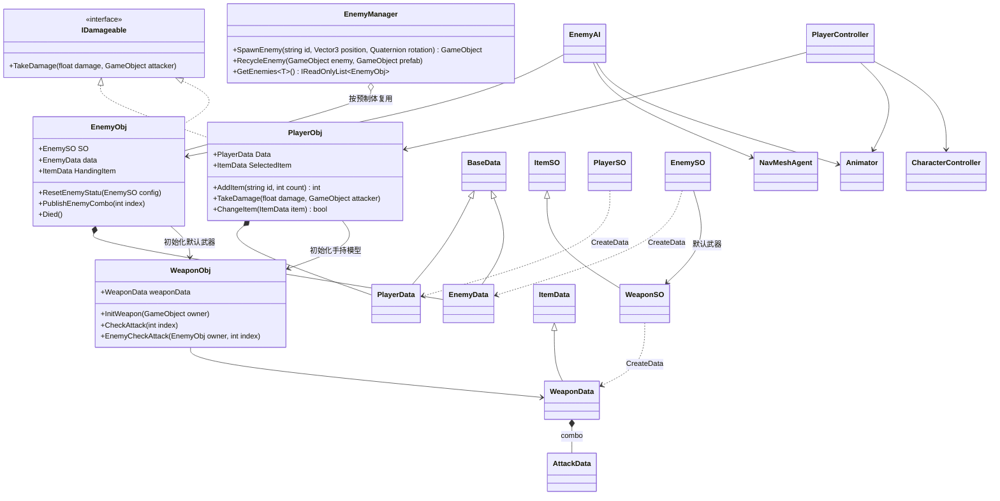
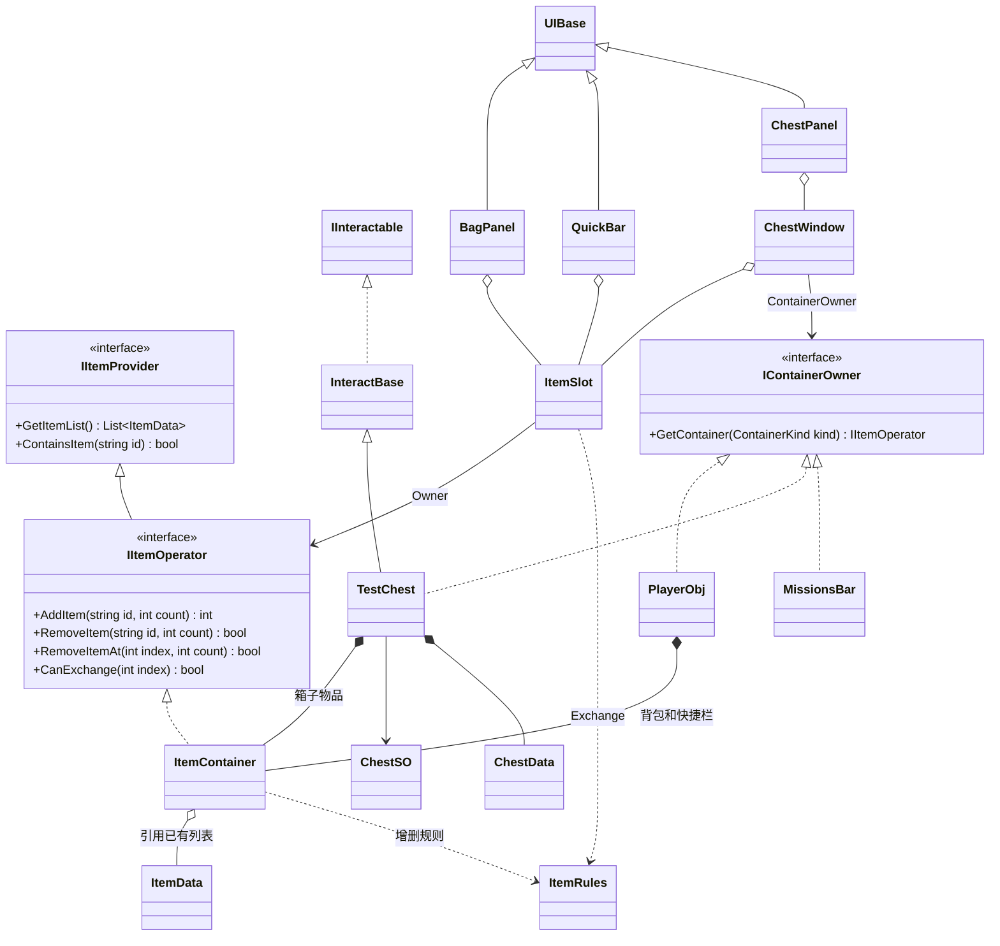
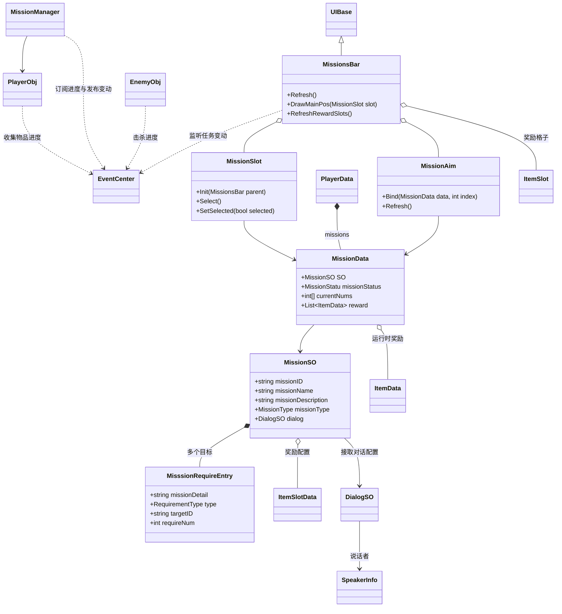
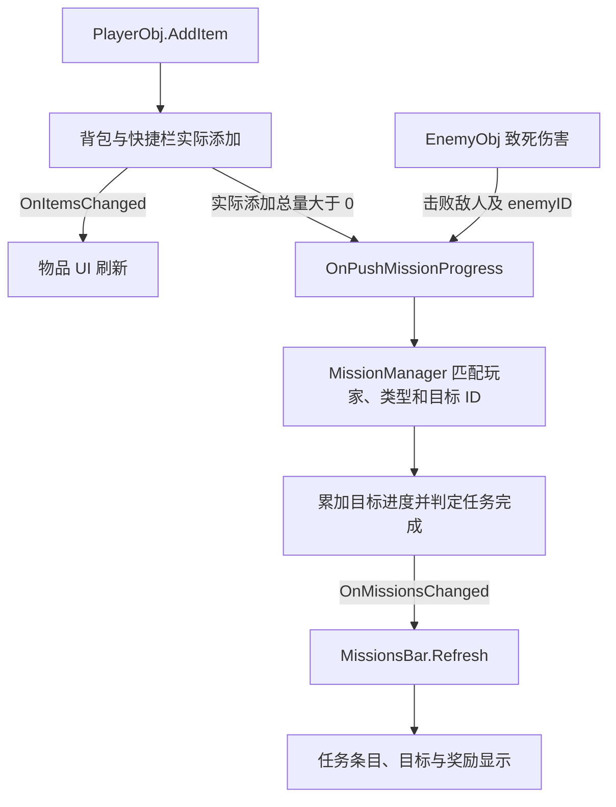

# Shimmering Chronicle

Shimmering Chronicle 是一个持续开发中的 Unity 动作 RPG 练习项目。围绕角色战斗、敌人追逐、物品收集和任务推进，练习 ScriptableObject 配置、运行时数据、事件总线和可复用 UI 的协作。

主场景为 `Assets/Scenes/SampleScene.unity`。仓库名为 `ShimmeringChronicle`，Unity 工程的 `productName` 目前仍为 `Practice`。本文描述当前源码中的实现，类图省略 Unity 基类、调试字段和部分泛型工厂层。

## 1. 当前功能

| 系统 | 已实现内容 |
| --- | --- |
| 玩家 | CharacterController 移动、跑步、动画状态切换、受击、死亡和手持物品切换 |
| 战斗 | 武器运行时数据、AnimatorOverrideController、动画事件驱动的分段攻击、范围与角度判定、同次判定命中去重 |
| 敌人 | 触发范围感知、NavMeshAgent 追逐、根运动位移、攻击朝向、连招、攻击间隔和受击硬直 |
| 对象池 | 按敌人预制体复用实例，重置角色与武器数据，死亡动画回调后回收 |
| 物品 | 固定格数背包与快捷栏、堆叠、扣除、交换、拆分、格子选中与模型装备 |
| 交互 | 范围与遮挡检测、F 键交互、箱盖开合、多个箱子窗口、窗口拖拽 |
| 任务 | 多目标配置、事件驱动的目标进度、击杀计数、添加物品计数、任务详情与奖励格子显示 |
| UI | 背包、快捷栏、玩家与敌人血条、任务面板；另有任务接取和左右头像对话框预制体 |
| 配置 | Addressables 分别异步加载 `ItemSO` 与 `EnemySO`，通过字符串 ID 查询 |

任务接取对话、地点与对话目标的自动通知、正式奖励发放和存档仍在完善，见“当前边界”。

## 2. 环境与启动

| 项目 | 当前配置 |
| --- | --- |
| Unity | `6000.3.10f1` |
| 渲染 | URP `17.3.0` |
| 配置加载 | Addressables `2.9.0`，标签 `ItemSO` / `EnemySO` |
| 导航 | AI Navigation `2.0.10` |
| 输入 | Input System `1.18.0`；角色代码目前使用旧 `Input` API，编辑器需允许旧输入 |
| UI | uGUI `2.0.0`、TextMesh Pro、EventSystem |
| 资源版本管理 | Git LFS；模型、贴图等资源按 `.gitattributes` 管理 |

首次获取工程时需安装 Git LFS 并下载资源：

```bash
git lfs install
git clone https://github.com/lphahapl/ShimmeringChronicle.git
cd ShimmeringChronicle
git lfs pull
```

通过 Unity Hub 打开工程，等待资源导入后打开 `SampleScene`。测试敌人使用 NavMesh；场景已有 `Assets/Scenes/SampleScene/NavMesh-GameManager.asset`，调整地形和可通行范围后应重新烘焙。构建游戏前还需按 Addressables 工作流构建资源。

场景主要依赖 `GameManager`、`UIManager`、`EnemyManager` 和 `MissionManager`。玩家需要 `PlayerObj`、`PlayerController`、`Animator`、`CharacterController`，并为 `PlayerObj.config` 指定 `PlayerSO`。当前 `PlayerObj.Awake()` 会用 `t` 创建测试任务并写入 `mission_001`，测试时也需绑定这个 `MissionSO`。

| 操作 | 按键 | 当前行为 |
| --- | --- | --- |
| 移动 | WASD / 方向轴 | 相对摄像机的水平移动 |
| 跑步 | 左 Shift | 使用 `PlayerData.runSpeed` |
| 攻击 | 鼠标左键 | 按当前武器连招配置触发动画，玩家最多三段 |
| 跳跃 | Space | 触发跳跃动画，尚无向上的物理初速度 |
| 交互 | F | 对当前最近且可见的目标执行交互 |
| 背包 | Tab | 开关 `BagPanel` |
| 任务 | V | 开关 `MissionsBar` |
| 手持物品 | 点击玩家物品格 / 鼠标滚轮 | 选择背包或快捷栏格子；滚轮切换快捷栏格子 |
| 测试受伤 | H | 对自身造成 50 点伤害 |
| 测试死亡 | L | 直接改变控制器死亡状态，不等价于将玩家 HP 归零 |

背包或箱子窗口打开、物品拖拽时会限制部分战斗输入；鼠标位于相关物品界面时也会屏蔽快捷栏滚轮。移动和 F 键交互尚未统一接入 UI 输入屏蔽。

## 3. 目录

```text
Assets/
  Scenes/                      主场景、NavMesh 与任务 UI 预览场景
  Scripts/
    SO/                        玩家、敌人、物品、武器、箱子、任务与对话配置
    Data/                      运行时数据、攻击段数据、GameEvents
    Interfaces/                伤害、交互、容器和手持物品契约
    Logic/                     角色、敌人 AI / 对象池、任务管理、事件中心、物品规则
    UI/                        UI 管理、背包、快捷栏、箱子窗口、任务面板和血条
  Configs/                     玩家、敌人、箱子和任务配置资产
  Prefabs/
    Items/<itemID>/             单个物品的配置与预制体，有动画时放 Animations/
    TestEnemy/                 方块测试敌人、控制器及测试动画
    UI/
      QuestPanel/              任务面板
      QuestOffer/              任务接取对话框
      Dialogue/                左右头像对话框
      Shared/                  任务条目、目标条目、奖励条目和 Canvas
  AddressableAssetsData/       Addressables 标签和分组
  Art/                        角色、武器、地形、房屋、植物与箱子资源
  Editor/                     美术生成、材质修复与场景调试工具
Tools/
  UI/                         UI 设计说明与检查资料
  WeaponConcepts/             武器参考、生成脚本与检查结果
  Environment/                测试地形和装饰生成记录
  SceneBackups/               场景修改前的备份
  ItemSlotTestResults/         历史格子测试记录
```

`Scripts/Logic` 和 `Scripts/UI` 是当前文件位置，例如 `ItemSlot`、`MissionSlot` 位于 `Logic`，`ItemContainer` 位于 `UI`；职责划分以代码为准。

## 4. 类图与职责

### 4.1 角色、敌人和武器

配置创建运行时数据，行为组件使用这些数据。玩家当前手持数据来自选中的物品格；敌人默认武器初始化后，`data.HandingItem` 与 `data.weaponData` 指向同一份武器运行时实例。



图中的 `ItemSO → WeaponSO` 继承关系省略了实际的 `ItemSO<WeaponData>` 中间层；玩家与敌人的 SO 工厂同样经过 `BaseDataSO<TData>`。

### 4.2 物品容器与交互

`ItemContainer` 是普通 C# 对象，包装现有列表；玩家、箱子和任务奖励通过 `IContainerOwner` 暴露容器。`ChestWindow` 表示单个箱子的窗口，`ChestPanel` 表示容纳多个窗口的界面。



### 4.3 任务与 UI

`MissionSO` 定义目标和奖励，`MissionData` 保存进度。`MissionManager` 只处理任务进度通知，UI 监听处理结果。



| 模块 | 职责 |
| --- | --- |
| `GameManager` | 分别加载物品和敌人配置，维护 ID 字典和对应加载任务 |
| `PlayerObj` | 持有玩家数据与容器，提供玩家级加物品入口，处理伤害、交互目标和手持模型 |
| `PlayerController` | 键鼠输入、移动、动画、玩家连招与快捷栏滚轮选择 |
| `EnemyManager` | 敌人注册、按类型查询、按预制体复用实例 |
| `EnemyObj` / `EnemyAI` | 敌人数据与生命周期 / 感知、导航、攻击决策和根运动同步 |
| `WeaponObj` | 按攻击段执行范围和角度检测，并向目标施加伤害 |
| `ItemContainer` / `ItemRules` | 容器增删和通知 / 查找、堆叠、扣除、交换与拆分规则 |
| `MissionManager` | 匹配目标类型与 ID，累加进度，判定所有目标完成并通知 UI |
| `UIManager` / `UIBase` | 按具体类型管理面板 / 显隐状态与刷新扩展点 |
| `MissionsBar` / `MissionSlot` / `MissionAim` | 任务面板 / 可点击任务条目 / 目标描述、计数和完成标记 |
| `EventCenter` / `GameEvents` | 同步强类型事件总线 / 全局事件键，支持 0～5 个参数 |

## 5. 物品与玩家 API

### 5.1 配置和运行时数据

`PlayerSO.CreateData()`、`EnemySO.CreateData()` 创建角色数据。物品通过 `ItemSO.CreateItemData()` 创建，武器也可使用强类型的 `WeaponSO.CreateData()`。运行时数量、HP、攻击间隔和 Buff 等应写入数据实例，不应回写 SO 资产。

- `ItemData.count` 是当前数量，`stackCount` 是单格上限；非正上限按 1 处理。
- 列表长度就是容器容量，空格保留 `null`。添加物品只合并堆叠和填空格，不追加新格。
- `PlayerSO.bagCapacity`、`quickBarCapacity` 和 `ChestSO.capacity` 用于初始化格数；初始配置超过容量时当前转换方法不会截断。
- 不要在容器初始化后直接替换 `Data.Bag` 或 `Data.quickBar` 的列表实例，容器和 UI 引用的是原列表。
- `ItemData.Clone()` 是浅复制；`WeaponData.Clone()` 另外复制 `combo` 和各个 `AttackData`。Prefab、Sprite 和动画控制器仍共享资产引用。

### 5.2 给玩家添加物品并推进任务

拾取、奖励等“玩家获得物品”的业务入口使用 `PlayerObj.AddItem`：

```csharp
// 在 GameManager.Awake() 执行后调用，例如其他组件的 Start() 中。
await GameManager.Instance.LoadingTasks.ItemComplete;

int requested = 3;
int added = player.AddItem("item_001", requested);
int remaining = requested - added;
```

该方法先放背包，剩余的放快捷栏，返回实际添加数量。各容器沿用 `OnItemsChanged` 刷新物品 UI；总添加数量大于 0 时，额外发布一次：

```csharp
OnPushMissionProgress(player.Data, RequirementType.收集物品, itemID, added)
```

无效 ID、非正数量、未准备好的物品配置或没有可用空间时，不计入未添加的部分。调用方应保留 `remaining`，避免物品未全部入包就销毁整个拾取对象或将奖励标记为已全部领取。

等待加载任务结束后仍需确认 `GetItem(id)` 有结果；加载结束标志不保证 ID 存在或所有配置有效。旧的 `GameManager.Ready` / `IsReady` 已由 `LoadingTasks` / `LoadingStatus` 替代。

### 5.3 直接操作单个容器

```csharp
IItemOperator bag = player.GetContainer(ContainerKind.Bag);
IItemOperator quickBar = player.GetContainer(ContainerKind.QuickBar);
bool owns = player.HasItem("item_001"); // 背包或快捷栏任一存在即可
int total = ItemRules.CountOf(bag.GetItemList(), "item_001");

int added = bag.AddItem("item_001", 5);
bool removed = bag.RemoveItem("item_001", 2);
bool removedAt = bag.RemoveItemAt(0, 1);
```

容器自己的 `AddItem` 只通知物品变化，不通知任务进度。`RemoveItem` 总量不足时完全不扣；`RemoveItemAt` 只操作指定格子。`FindItem(list, id, count)` 检查单格数量，跨堆总量使用 `CountOf`。

`GetContainer()` 默认返回玩家背包；`TestChest` 默认返回自身储物容器；`MissionsBar` 返回当前显示的奖励容器。`ItemContainer` 不是组件，不通过 `GetComponent<IItemOperator>()` 获取。

### 5.4 交换和选择

```csharp
bool allowed = ItemRules.CanExchange(player.Bag, 0, player.QuickBar, 1);
bool moved = ItemRules.Exchange(player.Bag, 0, player.QuickBar, 1);
// 单独的拆分示例：从背包第 0 格向快捷栏第 1 格转移 2 个。
bool movedTwo = ItemRules.Exchange(player.Bag, 0, player.QuickBar, 1, 2);
```

这些是独立操作示例，调用前需使用实际存在的格子索引。同 ID 合堆到上限，不同 ID 仅支持整堆互换；空目标格可以接收物品。成功后通知两边列表。背包与快捷栏互相移动不属于新增获取，不触发收集任务计数。

点击格子发布 `OnSlotSelectionRequested`，玩家仅接受自己的背包或快捷栏格子。选中后更新手持模型和 `PlayerData.HandingItem`，发布 `OnSelectedSlotChanged`。玩家战斗通过 `PlayerData.GetWeaponData()` 读取当前手持武器。

直接修改列表时需自行通知物品 UI：

```csharp
player.PublishBagChanged();
player.PublishQuickBarChanged();
```

这两个方法不补发任务进度。

## 6. 敌人、战斗与根运动

生成敌人前等待敌人配置：

```csharp
await GameManager.Instance.LoadingTasks.EnemyComplete;
GameObject enemy = EnemyManager.Instance.SpawnEnemy(
    "Enemy_001", spawnPosition, Quaternion.identity);
```

对象池以预制体为 key。新建和复用实例都通过 `ResetEnemyStatu(so)` 重新创建敌人数据、恢复碰撞体与血条、初始化武器与 AI，并通过 `Animator.Rebind()` 重绑动画状态。

默认武器配置相同且模型仍存在时复用模型，但重新创建武器运行时数据；配置不同时重新实例化武器。默认武器初始化完成后再发布 `OnEnemyChangedHandingItem`。`EnemyObj` 当前没有实现通用换手持接口。

`EnemyAI` 用触发器进入/退出记录玩家，重生时重新扩张感知范围。Agent 负责寻路，`updatePosition = false`，位移由 `OnAnimatorMove()` 读取 `animator.rootPosition`，高度取导航表面，再将位置反馈给 Agent。移动动画需要实际根位移；仅增加 Agent 的 `speed` 不能直接替代动画移动速度。

进入武器停止距离后停止追逐并尝试攻击。敌人当前使用 `Attack1` / `Attack2` Trigger，攻击前转向玩家；`WeaponData.attackBreak` 和 `EnemyData.hitStun` 保存运行时攻击间隔与硬直。

| 动画事件 | 接收组件 | 用途 |
| --- | --- | --- |
| `PublishPlayerCombo` | `PlayerController` | 从动画状态解析玩家攻击段，发布 `OnPlayerCombo` |
| `PublishEnemyCombo(int index)` | `EnemyObj` | 发布带敌人身份的攻击段事件，index 从 0 开始 |
| `ChangeAttackStatu` | `EnemyAI` | 结束当前攻击标记，整轮连招结束时设置攻击间隔 |
| `Died` | `EnemyObj` | 死亡动画结束后回收实例 |

武器根据拥有者订阅玩家或敌人攻击事件；敌人武器过滤事件里的 `EnemyObj`，防止其他敌人的攻击触发自身判定。判定使用球形范围和角度筛选，以拥有者的位置、朝向和 `judgeOffset` 确定中心；每次判定用集合避免同一角色的多个 Collider 重复受伤。

敌人 HP 归零时发布死亡和击杀任务进度，停止参与存活敌人查询，并触发死亡动画；实例回收由动画末尾的 `Died` 完成。`RecycleEnemy` 的队列检查防止同一空闲实例重复入队。

## 7. 任务系统

### 7.1 配置与进度

`MissionSO` 保存 `missionID`、名称、描述、主线/支线类型、接取对话、目标列表和奖励配置。每个 `MisssionRequireEntry` 包含：

| 字段 | 含义 |
| --- | --- |
| `missionDetail` | UI 目标描述 |
| `type` | 到达地点、击败敌人、收集物品、与人对话 |
| `targetID` | 目标标识，按要求类型匹配敌人 ID、物品 ID 或后续地点/角色 ID |
| `requireNum` | 需要完成的数量 |

`MissionData.currentNums[i]` 对应 `SO.requireMents[i]`。任务进行期间应保持目标数量和顺序稳定。奖励通过配置转换为运行时 `ItemData` 列表。

`MissionManager` 监听 `(PlayerData, RequirementType, targetID, count)`，过滤玩家后遍历任务，对类型和 ID 相同的目标累加数量，达到目标上限后封顶。所有目标完成时将 `missionStatus` 设为 `已完成`，然后发布 `OnMissionsChanged`。



目前收集目标统计的是通过玩家级 API **新获得的数量**，不会因使用、丢弃或移出背包而倒退。直接操作容器、拖入箱子物品、初始背包物品不会自动补计进度；若后续改为“当前持有数量”，需另外设计总量同步。

### 7.2 测试接取与其他目标通知

当前还没有正式接取 API，测试时可在任务管理器和玩家完成初始化后插入运行时任务：

```csharp
var data = player.Data;
if (!data.missions.ContainsKey(missionSO.missionID))
{
    data.missions.Add(missionSO.missionID, new MissionData(missionSO));
    player.Publish(GameEvents.OnMissionsChanged, data);
}
```

地点和对话完成时，后续业务组件可沿用现有进度事件：

```csharp
this.Publish(GameEvents.OnPushMissionProgress, player.Data,
    RequirementType.到达地点, locationID, 1);
```

`Dictionary` 本身不会自动发事件，接取、移除或直接修改任务后需显式通知。`completedMissions` 是单独的记录，当前进度处理器不会自动把已完成任务移入该字典，也不会自动发奖。

## 8. UI 与事件

### 8.1 面板使用

```csharp
UIManager.Instance.Open<BagPanel>();
UIManager.Instance.Toggle<MissionsBar>();
UIManager.Instance.Close<MissionsBar>();
UIManager.Instance.RefreshAll();
```

`UIManager` 按具体类型注册场景中的 `UIBase`，包括未激活对象，每种类型保留一个实例。动态创建面板需调用 `Register`。基类销毁时负责注销；子类重写 `OnDestroy()` 应调用 `base.OnDestroy()`。

`UIBase.Awake()` 将 `IsOpen` 与初始可见状态同步。实际显隐依赖 `viewRoot`，未绑定时当前 `Show/Hide` 只更新状态，不自动失活自身。

`MissionsBar` 监听自己玩家的 `OnMissionsChanged`。任务、目标和奖励格子不足时生成，多余时失活复用；刷新时尽量保留选中的任务。`MissionSlot` 用 `IPointerClickHandler` 处理左键选择，不依赖 Button。`MissionAim` 用不可交互 Toggle 显示完成状态。

主要接线要求：

- 背包：`player`、`slotPrefab`、`spawnPos`；快捷栏：`player`、固定 `quickSlots`，格数需与数据列表一致。
- 物品格：图标、数量、独立拖拽图、高亮和选中边框；拖拽图不拦截射线。
- 任务面板：玩家、任务标题/类型/描述、计数、关闭按钮，以及任务/目标/奖励预制体和各自父节点。
- `slotsParent`、`aimsParent` 使用竖向布局；`rewardSlotsPos` 使用网格布局。已有 `QuestPanel.prefab` 的对应节点是任务列表 Content、`ObjectiveList` 和 `RewardList`。
- 玩家与敌人血条绑定角色及填充/缓冲图片；敌人世界空间血条通过 `worldCanvas` 跟随主摄像机朝向。

左右头像对话框、任务接取框目前提供视觉预制体，尚未接入完整对话播放、接取和奖励发放流程。任务面板中的奖励格子目前表示配置奖励，不代表已经发放到玩家身上。

### 8.2 主要事件

| 事件 | 参数 | 用途 |
| --- | --- | --- |
| `HpChanged` | `GameObject, float hp, float maxHp` | 角色血条更新 |
| `Damaged` | `GameObject victim, float damage, GameObject attacker` | 已扣血后的受击反应 |
| `Died` | `GameObject` | 玩家或敌人的死亡响应 |
| `OnItemsChanged` | `List<ItemData>` | 容器 UI 按列表引用过滤变动 |
| `OnSlotSelectionRequested` | `ItemSlot` | 请求选中玩家物品格 |
| `OnSelectedSlotChanged` | `ItemSlot` | 更新选中边框和玩家武器动画 |
| `OnPlayerCombo` | `int index` | 玩家武器攻击判定 |
| `OnEnemyCombo` | `EnemyObj, int index` | 指定敌人的武器攻击判定 |
| `OnEnemyChangedHandingItem` | `EnemyObj, ItemData` | 敌人手持数据初始化完成后的通知 |
| `OnPushMissionProgress` | `PlayerData, RequirementType, string targetID, int count` | 累加对应任务目标进度 |
| `OnMissionsChanged` | `PlayerData` | 刷新对应玩家的任务面板 |
| `OnChestShow` / `OnChestHide` | `IContainerOwner` | 绑定或关闭指定箱子窗口 |
| `OnChestWindowHoverChanged` | `ChestWindow` | 箱子窗口悬停状态通知 |

必须使用 `GameEvents` 中的静态键实例。事件同步执行，不自动隔离异常或清理订阅；订阅和退订应成对。伤害事件回调只负责反应，不要再次施加同一次伤害。

## 9. 测试资源与工具

主场景包含测试 Terrain、植物、可进入房屋和可开合木箱。角色和长枪资源位于 `Assets/Art/33 宵宫`、`Assets/Art/Weapons/FalconOath`；方块敌人位于 `Assets/Prefabs/TestEnemy`，默认敌人武器及两段攻击动画位于 `Assets/Prefabs/Items/EnemyWeapon_001`。

`TestChest` 从 `ChestSO` 初始化独立容器，`ChestOpen.anim` 使用 Legacy Animation，同一动画正向开盖、反向关盖。F 键交互会切换箱盖和对应窗口，窗口关闭按钮也会关闭箱盖。`DragUI` 提供窗口拖拽。

| Unity 菜单 | 用途 |
| --- | --- |
| `Tools/Terrain/Create Gentle Test Ground` | 生成测试地形 |
| `Tools/Terrain/Add Test Village and Plants` | 添加植物和村落装饰 |
| `Tools/Terrain/Upgrade Accessible Test Houses` | 重建可进入房屋和入口坡道 |
| `Tools/Terrain/Check House Passages` | 检查玩家胶囊通过门口的净空 |
| `Tools/Terrain/Build and Scatter Low Poly Chests` | 重建并摆放可开合木箱 |
| `Tools/Items/Create Missing Item Prefabs` | 补建缺失物品预制体 |
| `Tools/Weapons/Build Falcon Oath` | 重建长枪预制体与材质映射 |
| `Tools/Weapons/Repair Falcon Scene Materials` | 修复场景长枪材质引用 |
| `Tools/Weapons/Check Scene Appearance` | 检查长枪材质和视图光照 |
| `Tools/Art/Upgrade Falcon and Bind Yoimiya` | 更新 PBR 贴图与角色材质绑定 |
| `Tools/Debug/Attach CC Scene Debug View` | 为玩家添加 CharacterController 可视化 |

生成工具可能修改资产、备份并保存场景；结果文件和历史测试记录位于 `Tools`。`CharacterControllerDebugView` 可显示胶囊、坡面射线、坡度和落地状态；`WeaponObj` 的调试绘制可显示攻击范围和命中目标。

## 10. 当前边界与验证

- 任务接取/提交对话、奖励领取、地点与对话目标的实际发布点、存档尚未形成完整流程。
- 收集任务是新增获取计数，需走 `PlayerObj.AddItem`；不会扫描全部容器变化，也不回溯接取前已有物品。
- 已完成任务尚未自动归档到 `completedMissions`；任务面板计数目前分别读取两个字典的数量。
- 敌人当前围绕有默认武器的测试配置工作；致死伤害的击杀通知要求攻击者能获取 `PlayerObj`，环境伤害和其他攻击者来源仍需扩展。
- 配置加载的失败处理和 Addressables handle 释放仍需完善，目前 `OnDestroy()` 只释放物品 handle。
- 对象池尚未提供预热、最大空闲数量或统一场景清理接口；测试环境尚未完成整体性能优化。
- 跳跃尚未接入真实跳跃位移，移动与交互的 UI 输入屏蔽尚未统一。
- 部分运行时脚本仍引用 `UnityEditor`，正式 Player 构建前需清理；编辑器脚本编译通过不代表所有目标平台构建已验证。

建议在 Play Mode 验证以下流程：

1. 配置加载完成后查询物品和敌人 ID，检查无缺失配置。
2. 背包堆叠、空格转移、拆分和满容量部分添加；确认返回数量与实际物品数量一致。
3. 选择玩家物品格，检查手持数据、模型和动画控制器同步。
4. 敌人发现玩家、追逐、两段攻击、硬直、死亡动画和对象池重生。
5. 击杀相同目标 ID 的敌人推进任务；通过玩家 API 获得物品推进收集目标，内部换格不重复计数。
6. 完成多个目标后检查任务状态、V 键开关、第一次点击关闭按钮、任务切换及条目复用。
7. F 键开关箱子、窗口拖拽、物品交换，以及鼠标悬停时快捷栏滚轮屏蔽。

本 README 按当前源码和资源结构整理；`Tools` 中的生成检查和历史记录不等于完整玩法回归测试。
