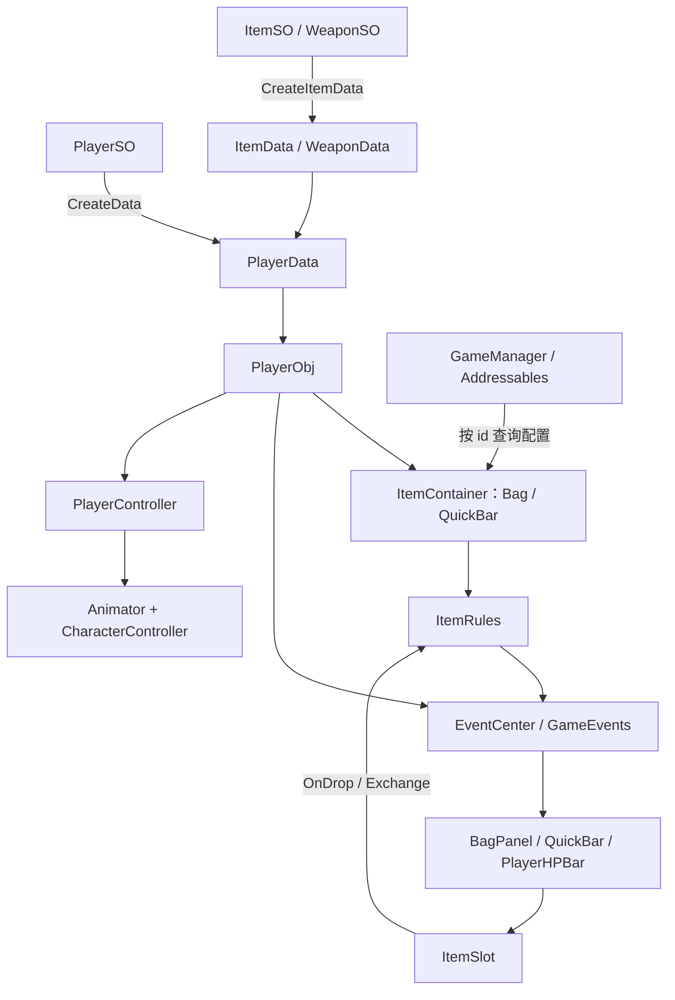

# Practice：Unity 角色与背包测试项目

本项目用于练习角色移动、Animator 状态切换、生命值、背包与快捷栏，以及基于 ScriptableObject 的配置和运行时数据分离。主场景为 `Assets/Scenes/SampleScene.unity`。本文按当前源码记录；示例是 Unity C# 调用，不是 HTTP API。

## 1. 环境与启动

| 项目 | 当前配置 |
| --- | --- |
| Unity | 6000.3.10f1（Unity 6.3 LTS） |
| 渲染 | URP 17.3.0 |
| 配置加载 | Addressables 2.9.0，物品标签 `ItemSO` |
| 输入 | 安装 Input System 1.18.0，Active Input Handling 为 Both；角色目前仍使用旧 `Input` API |
| UI | uGUI、TextMesh Pro、EventSystem |

通过 Unity Hub 打开项目根目录，等待资源导入，打开 `SampleScene` 后进入 Play Mode。发布前应按 Addressables 工作流构建资源；编辑器测试也要确认 Play Mode Script 能读取配置。

场景需要一个 `GameManager`、一个 `UIManager`，以及带 `PlayerObj`、`PlayerController`、`Animator`、`CharacterController` 的玩家。为 `PlayerObj.config` 指定 `PlayerSO`。摄像机的 `CameraMove.Player` 可直接指定，未指定时按 `Player` 标签查找。

| 操作 | 按键 | 当前行为 |
| --- | --- | --- |
| 移动 | WASD / 方向轴 | 相对摄像机的水平移动 |
| 跑步 | 左 Shift | 使用 `PlayerData.runSpeed` |
| 攻击 | 鼠标左键 | 触发最多三段 Animator 连招 |
| 跳跃 | Space | 触发跳跃动画；没有向上的物理初速度 |
| 测试受伤 | H | 对自身造成 50 点伤害 |
| 测试死亡 | L | 直接切换控制器的死亡状态，**不等价于将生命值归零** |
| 背包 | Tab | `UIManager.Toggle<BagPanel>()` |

## 2. 目录

```text
Assets/
  Scenes/                  主场景
  Scripts/
    SO/                    ScriptableObject 配置与数据工厂
    Data/                  运行时数据、事件键
    Interfaces/            伤害、交互、物品容器契约
    Logic/                 角色、事件中心、配置加载、物品规则和格子交互
    UI/                    UI 管理、背包、快捷栏、血条、ItemContainer
  Configs/                 玩家与物品配置资产
  AddressableAssetsData/   Addressables 标签和分组
  Art/Weapons/FalconOath/  长枪模型、PBR 材质、贴图与预制体
  Art/33 宵宫/             宵宫模型及已绑定材质的 Yoimiya_URP.prefab
  Art/Terrain/TestGround/  简单起伏 Terrain
  Art/Environment/TestVillage/ 测试树木、花草与建筑资源
  Editor/                 美术资产和测试场景生成菜单（仅编辑器）
Tools/
  WeaponConcepts/          武器参考图、Python 生成脚本和检查结果
  Environment/            测试装饰生成结果
  SceneBackups/           自动操作前的场景文件备份
  ItemSlotTestResults/    旧版格子测试记录，不代表当前版本的完整验证
```

## 3. 系统设计

### 配置、运行时数据与行为分离

`PlayerSO` 保存初始属性和初始物品；`PlayerObj.Data` 首次访问时调用 `CreateData()`，生成该角色独有的 `PlayerData`。`ItemSO` 的子类同样创建 `ItemData` 或 `WeaponData`。游戏中的数量、生命值应写入运行时数据，不要直接修改配置资产。



| 模块 | 责任与边界 |
| --- | --- |
| `GameManager` | 按 `ItemSO` 标签异步加载配置，建立 `id → ItemSO` 字典；销毁时释放 Addressables handle |
| `PlayerObj` | 持有角色数据，提供背包/快捷栏操作接口，处理伤害并发布事件 |
| `PlayerController` | 读取键鼠，控制移动和动画；监听本角色受伤、死亡事件 |
| `ItemContainer` | 包装现有 `List<ItemData>`，提供增删操作并通知 UI |
| `ItemRules` | 静态物品规则：查找、合堆、扣除、交换、拆分 |
| `UIManager` | 按 UI 的具体类型管理场景内面板；每种类型保留一个实例 |
| `UIBase` | 统一显隐状态和 `Refresh`、`OnShow`、`OnHide` 扩展点 |
| `ItemSlot` | 展示数据、悬停高亮和拖拽；落点直接调用 `ItemRules.Exchange` |
| `EventCenter` | 同步、全局、强类型事件总线，支持 0～5 个参数 |
| `InteractBase` | 封装重复/一次性/交互后销毁策略，具体交互由子类实现 |

### 主要流程

1. `GameManager.Awake()` 启动物品配置加载，`Ready` 表示对应异步任务。
2. `UIManager.Awake()` 收集场景中的 `UIBase`，包括未激活对象。动态创建的面板需要主动 `Register`。
3. `PlayerObj.Data` 延迟构造；`Bag` 和 `QuickBar` 各包装一份数据列表。`PlayerObj.Start()` 调用 `UIManager.RefreshAll()`。
4. 背包/快捷栏绑定容器，格子绑定 `ItemData + index + owner`。事件携带具体列表，UI 通过列表引用判断是否需要刷新。
5. `TakeDamage` 修改 HP，依次发布 `Damaged`、`HpChanged`，致死时再发布 `Died`。控制器负责动画响应，血条负责显示。

### 数据约定

- `ItemData.count` 是当前数量，`stackCount` 是单格上限；非正堆叠上限按 1 处理。
- 空格保留 `null`，不要随意 `RemoveAt`，否则后续格子的索引会整体变化。
- `ToItemDataList()` 按 `ItemSlotData.num` 创建数量；空配置和非正数量转换为 `null`，保留位置。
- `ItemData.Clone()` 为浅复制；`WeaponData.Clone()` 另外深复制 `combo` 和各个 `AttackData`。Sprite、Prefab、动画控制器仍共享资产引用。
- `PlayerObj` 缓存的容器引用原列表；初始化后不要直接换掉 `Data.Bag` 或 `Data.quickBar` 的列表实例。
- `AddInto` 会合并同 id 堆叠、填空格，然后追加新格；当前没有背包容量限制。

## 4. API 调用方法

### 4.1 等待物品配置并加入背包

把下面脚本挂到测试对象，为 `player` 绑定场景中的 `PlayerObj`。`item_001` 是项目现有物品 id。

```csharp
using System;
using UnityEngine;

public class InventoryExample : MonoBehaviour
{
    [SerializeField] PlayerObj player;

    async void Start()
    {
        var manager = GameManager.Instance;
        if (manager == null || player == null) return;
        try
        {
            await manager.Ready;
            if (this == null || player == null || manager == null) return;
            var config = manager.GetItem("item_001");
            if (config == null) return;

            int added = player.Bag.AddItem(config.id, 3);
            Debug.Log($"实际添加：{added}");
        }
        catch (Exception e) { Debug.LogException(e); }
    }
}
```

`Ready` 完成不代表一定加载成功；仍需检查 `GetItem` 返回值。当前失败分支可能将 `IsReady` 设为 true，异步异常也可能向上传递。空 id、重复 id 会记录错误；重复项保留先加载的那一个。

### 4.2 创建运行时数据

以下片段中的 `playerConfig`、`itemConfig`、`weaponConfig` 均为已绑定的对应 SO 引用。

```csharp
PlayerData freshPlayer = playerConfig.CreateData(); // PlayerSO
ItemData freshItem = itemConfig.CreateItemData();  // ItemSO 通用入口
WeaponData freshWeapon = weaponConfig.CreateData(); // WeaponSO 强类型入口
ItemData independentCopy = freshWeapon.Clone();
```

这只是创建数据，不会自动入包、实例化模型、装备武器或触发 UI 更新。`WeaponSO.combo` 的元素不能为 null，当前 `FillExtra` 会直接调用每个元素的 `Clone()`。

### 4.3 容器查询与增删

场景对象通过 `IContainerOwner.GetContainer(ContainerKind kind = ContainerKind.Default)` 提供容器；`ItemContainer` 是普通 C# 对象，不能用 `GetComponent<IItemOperator>()` 查找。用 `GetComponentInParent<IContainerOwner>()` 可以从箱体碰撞子物体找到拥有者。

调用约定：箱子等单容器对象统一调用 `GetContainer()`，使用 `Default`。只有玩家需要选择栏位时才显式指定 `Bag` 或 `QuickBar`；单容器实现不需要按类型分支。

| 拥有者 | `Default`（省略参数） | `Bag` | `QuickBar` |
| --- | --- | --- | --- |
| `PlayerObj` | 玩家背包 | 玩家背包，与默认返回同一实例 | 独立快捷栏 |
| `TestChest` | 当前箱子的储物容器 | 同一储物容器 | 同一储物容器 |

省略参数时使用 `Default`；对象没有专门处理的类型（包括未知枚举值）也回退到默认容器。玩家仅对 `QuickBar` 返回快捷栏，其余返回背包；箱子所有类型都返回自身储物容器。玩家缺少 `PlayerSO` 时仍可能返回 `null`。接口和实现类都声明默认参数，因此通过接口或具体类调用均可省略参数。重复获取会复用容器，每只箱子的物品列表相互独立。箱子目前为初始空的运行时容器，没有容量限制或存档恢复。

```csharp
IContainerOwner owner = hit.collider.GetComponentInParent<IContainerOwner>();
IItemOperator container = owner?.GetContainer();
if (container != null)
{
    bagPanel.Bind(container);
    // AddItem 仍要求 GameManager 完成初始化。
    int added = container.AddItem("item_001", 1);
}

IItemOperator quickBar = player.GetContainer(ContainerKind.QuickBar);
```

`BagPanel` 和 `QuickBar` 的玩家来源通过显式类型获取；已有的 `player.Bag`、`player.QuickBar` 属性仍可使用。取容器本身不打开箱盖或 UI，也不进行距离、锁定等交互权限检查。

```csharp
IItemOperator bag = player.Bag;
bool owns = player.HasItem("item_001"); // 背包或快捷栏里任一有即可
int total = ItemRules.CountOf(bag.GetItemList(), "item_001");
int first = ItemRules.FindItem(bag.GetItemList(), "item_001"); // 不存在为 -1
int added = bag.AddItem("item_001", 5);   // 自动发布变更事件
bool removed = bag.RemoveItem("item_001", 2); // 跨堆扣除，不足则完全不扣
bool removedAt = bag.RemoveItemAt(0, 1); // 只扣第 0 格，不足返回 false
```

`FindItem(list,id,count)` 查找**单个格子**数量是否足够；跨堆总量请用 `CountOf`。`GetItemList()` 暴露的是原始可变列表，不是副本。

```csharp
// 直接改列表时需自行通知 UI；通常优先使用容器 API。
player.Data.Bag[0] = null; // 前提：列表已经初始化且存在第 0 格
player.PublishBagChanged();
player.PublishQuickBarChanged(); // 修改快捷栏后使用
```

### 4.4 交换、合堆和拆分

```csharp
bool allowed = ItemRules.CanExchange(player.Bag, 0, player.QuickBar, 1);
bool moved = ItemRules.Exchange(player.Bag, 0, player.QuickBar, 1);
bool movedTwo = ItemRules.Exchange(player.Bag, 0, player.QuickBar, 1, 2);
```

以上是三次独立调用示例，请按需求选择；索引必须对应真实列表格子。`count <= 0` 或大于源数量时按整堆处理。同 id 合堆到上限，不同 id 仅支持整堆互换。`Exchange` 成功时通知两边列表，同一列表也会被通知两次。

**当前实现限制：** `ItemRules.CanExchange` 同时调用两端容器的 `CanExchange`，而 `ItemContainer.CanExchange` 对空格返回 false。因此虽然规则中写了“移动到空格”的分支，使用当前 `ItemContainer` 时会提前拒绝空目标。本文记录此行为，没有在文档任务中修改规则。

### 4.5 UI 面板

```csharp
UIManager.Instance.Open<BagPanel>();
UIManager.Instance.Close<BagPanel>();
UIManager.Instance.Toggle<BagPanel>();
BagPanel panel = UIManager.Instance.Get<BagPanel>();
if (panel != null) panel.Bind(player.Bag);
UIManager.Instance.RefreshAll();
```

调用前确保场景中的 `UIManager` 已执行 Awake。`Get<T>()` 未找到时返回 null 并记录警告。`Open<T>()` 会将面板移到同级最后，再调用 `Show()`。

新面板继承 `UIBase`，重写 `Refresh()` / `OnShow()` / `OnHide()`。动态实例化后调用 `UIManager.Instance.Register(panel)`；销毁时基类负责注销。重写 `OnDestroy` 需要调用 `base.OnDestroy()`。

Inspector 接线要求：

- `UIBase.viewRoot` 指定实际显隐根节点。**当前代码在 viewRoot 为空时只修改 IsOpen，不会自动 SetActive 自身。**
- `BagPanel` 绑定 `player`、带 `ItemSlot` 的 `slotPrefab` 和 `spawnPos`；也可通过 `Bind` 指定其他容器。
- `QuickBar` 绑定 `player` 和固定 `quickSlots`。容器可增长，超过已绑定格子数的物品不会显示。
- `ItemSlot` 绑定 `iconImage`、`countText`、独立的 `dragImage` 和高亮 `mask`。拖拽图不能与原图是同一个 Image，应初始隐藏且不拦截射线。
- 当前拖拽位置直接使用屏幕坐标，适合 Screen Space Overlay；换成其他 Canvas 模式需要坐标转换。
- `PlayerHPBar` 绑定 `player`、`fill`、`buffer` 和 `hpPrompt`；血条图片应配置为 Filled。

### 4.6 伤害、移动和动画

```csharp
player.TakeDamage(25f, attacker); // attacker 为 GameObject，也可传 null
var motor = player.GetComponent<PlayerController>();
motor.SetMove(Vector3.forward, false); // 世界坐标方向
motor.StopMove();
motor.Attack();
motor.Jump();
Debug.Log(motor.CurrentStateName);
```

`SetMove` 会将方向投影到水平面并归一化，但 `Update` 中的 `ReadKeyboard()` 每帧会覆盖它。要由 AI 或其他输入源持续控制，需要先拆分或关闭现有键盘读取逻辑。

`Attack()` 目前只触发动画，不使用 `WeaponData.combo` 自动做伤害判定。`Jump()` 只发 Animator Trigger。业务死亡应通过 HP/伤害流程；`PlayerController.Die()` 只改变控制器和动画状态，不修改 `PlayerObj.IsDead` 或 HP。`DestorySelf()` 按当前源码拼写提供销毁接口。

Animator 参数需要包含 `IsWalking`、`IsRunning`、`IsDead`（Bool），`Jump`、`Hit`、`Attack_01`、`Attack_02`、`Attack_03`（Trigger）。状态判断依赖 `Idle`、`Walk`、`Run`、`Jump` 等名称。

### 4.7 订阅事件

```csharp
using UnityEngine;

public class HpListenerExample : MonoBehaviour
{
    [SerializeField] PlayerObj player;
    void OnEnable() => this.Subscribe(GameEvents.HpChanged, OnHp);
    void OnDisable() => this.UnSubscribe(GameEvents.HpChanged, OnHp);
    void OnHp(GameObject who, float hp, float maxHp)
    {
        if (player == null || who != player.gameObject) return;
        Debug.Log($"HP：{hp}/{maxHp}");
    }
}
```

| 事件 | 参数 | 发布时机 |
| --- | --- | --- |
| `Damaged` | `GameObject victim, float damage, GameObject attacker` | 生命值已扣除；damage 为传入伤害值 |
| `HpChanged` | `GameObject who, float hp, float maxHp` | 受伤更新生命值后 |
| `Died` | `GameObject who` | `PlayerObj` 首次受到致死伤害 |
| `OnItemsChanged` | `List<ItemData> changed` | 容器增删、规则交换或手动发布 |

必须使用 `GameEvents` 中的同一静态键实例；新建一个同类型 `EventKey` 不会匹配原订阅。事件同步执行，不自动去重、隔离异常或清理订阅。匿名 lambda 若需要退订，应保存原委托。回调中不要再次执行造成同一事件的业务操作，以免递归。

### 4.8 新增拾取交互

```csharp
using UnityEngine;

public class TestPickup : InteractBase
{
    public string itemId = "item_001";
    public int amount = 1;
    public override string InteractPrompt() => "拾取物品";
    protected override bool InteractLogic(GameObject interactor)
    {
        if (interactor == null || amount <= 0) return false;
        var player = interactor.GetComponent<PlayerObj>();
        return player != null && player.Bag != null
            && player.Bag.AddItem(itemId, amount) == amount;
    }
}
```

为实例设置 `interactType = DestroyAfterInteract`，成功才会销毁。调用方通过 `CanInteract(actor)` 和 `OnInteract(actor)` 使用接口。项目当前没有自动查找交互目标并按 E 执行的完整输入流程，需另接射线/触发器检测。示例依赖当前无容量限制的 AddItem；将来允许部分添加时应另外处理剩余数量。

## 5. 测试环境与美术资源

主场景包含 160 × 160 米的缓坡 Terrain，总高差约 2.8 米，中心约 10 米半径保持平坦。原 Plane 停用保留。

测试装饰集中在 `Test Environment - Village and Plants` 根节点：32 棵树、35 组花丛、65 组草、3 座简易可进入建筑和 7 个箱子。花草无碰撞，树干、建筑主体和箱子有碰撞。中心活动区和交叉通道留空；使用程序化基础形体、共享 URP 材质，供功能测试，尚未做 LOD、烘焙和性能优化，也没有烘焙 NavMesh。

| Unity 菜单 | 用途 |
| --- | --- |
| `Tools/Terrain/Create Gentle Test Ground` | 首次生成测试地形；已有数据资产时不重复生成 |
| `Tools/Terrain/Add Test Village and Plants` | 添加测试装饰；同名场景根节点存在时跳过 |
| `Tools/Terrain/Upgrade Accessible Test Houses` | 重建三栋测试房屋，保存独立预制体并验证进出；会备份、保存场景 |
| `Tools/Terrain/Check House Passages` | 按当前玩家胶囊尺寸检查房屋门口至室内的碰撞净空 |
| `Tools/Weapons/Build Falcon Oath` | 重建长枪预制体，并给 OBJ 映射正式材质 |
| `Tools/Weapons/Repair Falcon Scene Materials` | 修正仍引用 OBJ 内嵌材质的场景实例，开启 Scene 光照 |
| `Tools/Weapons/Check Scene Appearance` | 输出长枪材质、视图光照与反射检查信息 |
| `Tools/Art/Upgrade Falcon and Bind Yoimiya` | 配置长枪 PBR 贴图并重建宵宫 27 个材质槽映射 |

部分编辑器工具带 `InitializeOnLoad` 首次执行逻辑，通过 `Tools` 下的结果文件防重复。地形/装饰工具会备份并保存当前 SampleScene；美术升级会改写生成的材质参数。不要把这些菜单当作无副作用的查询按钮。场景备份不包含全部资源副本。

### 可进入的测试房屋

三栋房屋的资源位于 `Assets/Art/Environment/TestHouses`，包含独立房屋预制体、瓦片屋顶、山墙、木结构、窗框、门廊、桌凳和置物架。门洞净宽 2.6 米、净高 3.6 米；旧门洞仅高 2.5 米，会阻挡当前高 2.98 米的玩家控制器。入口改为约 4 米长的贴地坡道，室内中央保持通畅。

升级工具会按各房屋位置采样地形设置地板高度和坡道，保留房屋位置与朝向；移动预制体到其它地形后需重新调整入口。装饰瓦片没有碰撞，基础地板、墙体、窗玻璃、屋顶和主要家具使用碰撞体。窗玻璃使用 URP Lit 透明混合，淡蓝色、Alpha 0.16，关闭深度写入及阴影投射；可透视但仍有碰撞。房门保持敞开，没有开关门逻辑。

`Tools/Environment/house-before.txt` 记录旧门楣阻挡；`house-after.txt` 记录净空检查；`house-walk.txt` 用与当前玩家相同尺寸及爬坡参数的临时 CharacterController，在编辑器中调用 Move 验证三栋房屋进入与退出，不移动真实玩家。这不等同于完整 Play Mode 下动画、相机的人工体验测试。

### 测试箱子（低面数，可开合）

靠近可交互物体时，`PlayerObj` 在玩家位置上方 0.8 米进行默认半径 2 米的范围检测，向碰撞体父级查找 `IInteractable`，选取最近且未被实体遮挡的可交互目标。`prompt` 显示 `[F]` 加目标提示；离开范围、目标不可交互或玩家死亡时隐藏。`PlayerController` 通过 `GetKeyDown(KeyCode.F)` 调用 `player.TryInteract()`，不再碰撞即自动开箱。可在 PlayerObj 上调整 `interactionRange`、`interactionMask`；检测层需包含箱体子物体所在层。使用旧 Input，尚未接入 UI 输入屏蔽。

`Assets/Art/Environment/TestChest/TestChest.prefab` 是独立可复用的木箱预制体，每只 540 个三角面，含空心箱体、独立箱盖、铁箍和铜扣。主场景的 `Test Environment - Village and Plants/Scattered Chests` 下已分散放置 7 只，替换原来的方块箱子。

`ChestOpen.anim` 使用 Legacy Animation，0.65 秒绕背部铰链打开 108°，关闭时反向播放，同一动画支持开合途中反向。默认关闭，不自动播放。箱体使用简化 BoxCollider；箱盖无碰撞，不用于物理容器。

```csharp
TestChest chest = chestObject.GetComponent<TestChest>();
chest.Open();
chest.Close();
chest.Toggle();
bool targetIsOpen = chest.IsOpen; // 目标状态，不表示动画已经播完

// 已继承 InteractBase，可从未来的交互检测系统调用：
chest.OnInteract(playerGameObject);
```

Play Mode 下可在 TestChest 组件右键菜单使用 `Preview/Open (Play Mode)` 和 `Preview/Close (Play Mode)`。尚未接入按键检测、奖励或存档。

Unity 菜单 `Tools/Terrain/Build and Scatter Low Poly Chests` 可重建资源并重新摆放这 7 只箱子；会备份并保存 SampleScene，覆盖箱子生成资源及位置。生成检查见 `Tools/Environment/chest-result-v2.txt`。

## 6. 当前边界与后续工作

- 打开背包目前不会禁用移动/攻击；旧 Input 读取不受 UI Raycast 阻挡。后续可拆出角色输入组件或切换 Input System Action Map。
- 空目标格拖拽的容器校验存在前述限制；拆分数量也没有对应的 UI 操作入口。
- 尚未实现完整装备切换、武器判定、物品使用、存档、AI 和导航流程。配置字段存在不代表玩法已接通。
- UIManager 按具体类型注册一个面板；不能直接用同一类型管理多个独立窗口。
- SO 工厂与运行时字段需同步维护；新增可变引用字段需检查深复制。
- `Tools/ItemSlotTestResults` 是历史记录，其中旧版落点事件说明与当前直接 Exchange 实现不同，应以当前源码为准。
- 部分旧源码中文注释存在编码显示问题，本文使用 UTF-8，不顺带改写那些文件。

## 7. 验证入口

### CharacterController 坡面可视化

玩家挂载 `CharacterControllerDebugView`。在 Scene 视图打开 Gizmos，Play Mode 下观察角色上坡、下坡或跨台阶；无需选中角色（可勾选 `Only When Selected` 限制显示）。`Show` 控制显示，`Probe Distance` 控制向下探测距离，`Ground Mask` 过滤检测层。

- 青色：按 CC Center、Height、Radius 和物体缩放绘制的胶囊。
- 黄色：胶囊最低点平面与 Step Offset 高度圈。
- 绿色/红色：中心和四周向下射线、命中法线；红色表示坡度超过 Slope Limit。灰色表示未命中。
- 紫色：Humanoid 左右脚骨位置及到地面的竖直距离，脚骨不等于鞋底。
- 文字：最后一次 Move 的 isGrounded、CollisionFlags、CC 速度、中心探测坡度、胶囊底部至地面竖直间距及 Skin Width。编辑模式不评估 isGrounded。

射线是独立的调试探测，不是 CC 内部接触算法；球形底部在坡面上接触时，中心竖直间距可能大于零，不能单靠该数值判定悬空。结合 isGrounded、法线及脚骨/模型位置判断。组件不调用 Move、不修改贴地逻辑，也不实现脚部 IK，绘制逻辑只在编辑器编译。菜单 `Tools/Debug/Attach CC Scene Debug View` 可为主场景玩家补挂组件并保存场景。

```powershell
# OBJ 所有面是否有有效法线；需要本机 Python
python Tools/WeaponConcepts/check_falcon_normals.py
```

`Tools/Environment/environment-result.txt` 记录装饰生成结果；`Tools/WeaponConcepts/test-terrain-result.txt` 记录地形尺寸与碰撞检查。它们属于生成时检查，不等同于角色移动、每个建筑碰撞和整套背包功能的完整 Play Mode 回归测试。

建议在 Play Mode 手动验证：出生点落地、缓坡移动、树干/屋墙碰撞、穿过门洞、Tab 显隐、H 扣血、背包添加与扣除、有效非空格之间交换。当前项目没有可直接宣称覆盖全部系统的自动化测试套件。
